# PillReminder — Architecture, Flows & Decision Logic

> **Purpose.** The technical companion to
> [`01-functional-overview.md`](./01-functional-overview.md): system structure, data
> model, control flow, the decision rules that govern behaviour, and the failure modes
> each design choice is defending against.
>
> Diagrams are Mermaid and render on GitHub, in VS Code with a Mermaid extension, and in
> most Markdown viewers.

---

## Contents

1. [System context](#1-system-context)
2. [Layered architecture](#2-layered-architecture)
3. [Data model](#3-data-model)
4. [Security architecture (RLS)](#4-security-architecture-rls)
5. [Module M1 — Identity & Session](#5-module-m1--identity--session)
6. [Module M2/M3 — Medicine → Alarm pipeline](#6-module-m2m3--medicine--alarm-pipeline)
7. [Module M4/M5 — Dose response & state derivation](#7-module-m4m5--dose-response--state-derivation)
8. [Module M6 — Guardian pairing](#8-module-m6--guardian-pairing)
9. [Module M7 — Missed-dose detection](#9-module-m7--missed-dose-detection)
10. [Module M8 — Approval workflow](#10-module-m8--approval-workflow)
11. [Module M9 — Health trackers](#11-module-m9--health-trackers)
12. [Module M10 — Plans & entitlement](#12-module-m10--plans--entitlement)
13. [Module M11 — Offline, caching & retention](#13-module-m11--offline-caching--retention)
14. [Navigation graph](#14-navigation-graph)
15. [Cross-cutting technical decisions](#15-cross-cutting-technical-decisions-and-why)
16. [Failure-mode analysis](#16-failure-mode-analysis)
17. [Known architectural debt](#17-known-architectural-debt)

---

## 1. System context

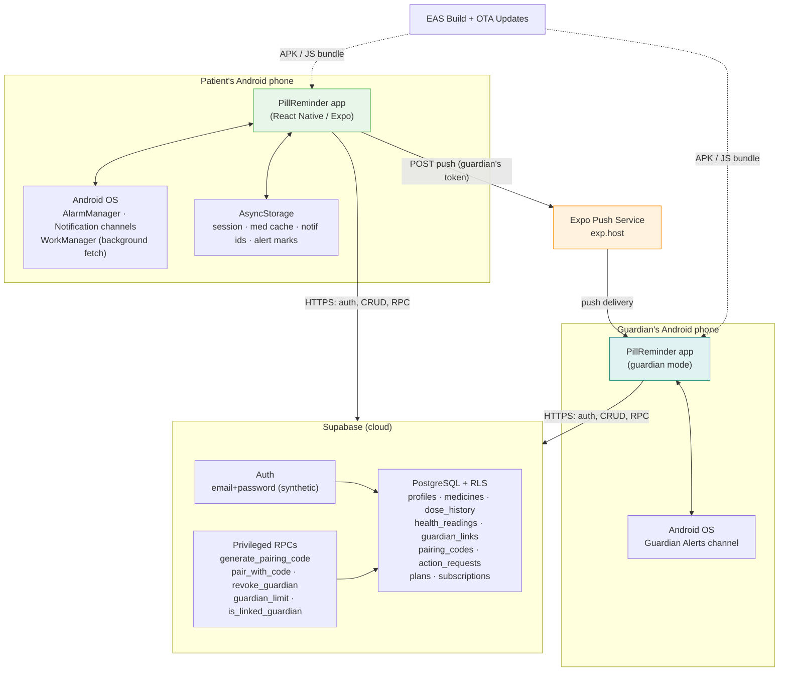

**The one structural anomaly to notice.** The push arrow originates at the *patient's
device*, not at the server. There is no backend process in the alerting path — the
patient's app reads the guardian's push token out of the database and posts to Expo
itself. Section [9](#9-module-m7--missed-dose-detection) analyses the consequences.

---

## 2. Layered architecture

```mermaid
flowchart TD
    subgraph L1["Presentation — src/screens, src/components"]
        S1["LoginScreen"]:::pt
        S2["HomeScreen"]:::pt
        S3["AddMedicineScreen"]:::pt
        S4["AlarmScreen"]:::pt
        S5["GuardianScreen"]:::pt
        S6["TrackersScreen · HealthReportScreen"]:::pt
        S7["PlansScreen"]:::pt
        S8["ApprovalsScreen"]:::pt
        S9["GuardianDashboardScreen · GuardianUserScreen"]:::gd
        C1["WheelTimePicker · DaysSelector"]:::cmp
    end

    subgraph L2["Orchestration — App.js"]
        O1["Navigator + initial route"]
        O2["Notification received listener"]
        O3["Notification response listener<br/>(TAKEN · RESCHEDULE · SKIP)"]
        O4["AppState → sweep"]
        O5["Boot: setup · resync · push token · background task"]
    end

    subgraph L3["Domain / service — src/utils"]
        U1["storage.js<br/>auth · medicines · dose history"]
        U2["notifications.js<br/>channels · triggers · resync"]
        U3["guardian.js<br/>sweep · push · background task"]
        U4["guardianCloud.js<br/>pairing · settings · requests"]
        U5["health.js"]
        U6["subscription.js"]
        U7["payments.js (stub)"]
        U8["sync.js<br/>resyncAlarmsFromCloud"]
        U9["ringtone.js (system picker, unused)"]
    end

    subgraph L4["Infrastructure"]
        I1["supabase.js client<br/>(AsyncStorage-backed session)"]
        I2["AsyncStorage<br/>cache · notif ids · alert marks"]
        I3["expo-notifications"]
        I4["expo-task-manager +<br/>expo-background-fetch"]
        I5["expo-av · expo-keep-awake · Vibration"]
    end

    subgraph L5["Cloud — supabase/*.sql"]
        D1["Tables + RLS policies"]
        D2["SECURITY DEFINER functions"]
        D3["Trigger: handle_new_user"]
        D4["pg_cron retention (pending)"]
    end

    L1 --> L2
    L1 --> L3
    L2 --> L3
    L3 --> L4
    L4 --> L5

    classDef pt fill:#e8f5e9,stroke:#4CAF50
    classDef gd fill:#e0f2f1,stroke:#00796b
    classDef cmp fill:#f3e5f5,stroke:#8e24aa
```

### Layer rules actually observed in the code

| Rule | Where it holds | Where it leaks |
|---|---|---|
| Screens never import the Supabase client directly | all screens go through `utils/*` | — |
| Domain modules own all persistence | yes | `sync.js` straddles two domains by design |
| Storage API shape survived the local→cloud migration | `storage.js` kept its original signatures (hence vestigial `user` parameters that are now ignored) | callers still pass `user`; harmless but confusing |
| Business rules that must be trusted live in SQL | pairing, guardian limits | entitlement *display* is client-side |

**Why `storage.js` looks the way it does.** It began as a pure AsyncStorage module. The
P0 cloud migration replaced its internals with Supabase calls but deliberately preserved
every exported function signature, so no screen needed rewriting. The cost is a set of
now-ignored `user` arguments (`addMedicine(user, med)` derives the uid from the session
instead). Cleaning this up is a mechanical refactor listed in the sprint plan.

---

## 3. Data model

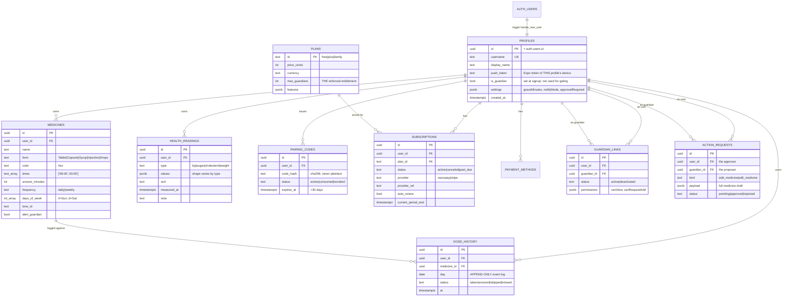

### Schema decisions and their rationale

| Decision | Rationale | Cost |
|---|---|---|
| `profiles` is one table for *both* roles | a person can be a patient and someone else's guardian simultaneously; two tables would duplicate identity | role is contextual, so no role-based gating is possible without extra work |
| `times` as `text[]`, not a child table | a schedule is read as a unit and never queried by individual time | cannot index or query "all medicines due at 08:00" across users — needed later for a server-side sweep |
| `days_of_week` as `int[]` with JS-native `0=Sun` | matches `Date.getDay()` so the client needs no translation | the alarm scheduler *does* translate: Expo's weekday is 1-based, so it sends `dow + 1` |
| `dose_history` append-only with `(day, status, at)` | enables snooze-aware deadlines, adherence analytics, and clinical export from one table | rows accumulate; retention job required |
| `health_readings.values` as `jsonb` | new vitals need no migration | no type-level validation in the DB |
| `pairing_codes` stores only a hash | a database leak yields no usable codes | codes cannot be re-displayed; a new one must be generated |
| `plans` in the DB, not the binary | pricing/limits change without an app release | client must tolerate unknown plan ids |
| `payment_methods.token_ref` only | never store raw card data — PCI scope avoidance | full provider dependency |

### One schema-level correctness note

`dose_history.day` is written by the client as a **UTC** date, while dose *times* are
interpreted in the device's local zone. In IST (UTC+5:30) any dose logged between 00:00
and 05:29 local time is filed under the previous day. The effect is a shifted day
boundary in the ledger, the Today view and adherence reporting for every non-UTC user.
The fix (compute the local date, or store a `tz` on the profile and compute day
server-side) is scheduled as a Sprint 5 correctness item.

---

## 4. Security architecture (RLS)

Every table has row-level security enabled, so the default is **deny**. The shipped
public key grants no data access on its own; access comes only from policy.

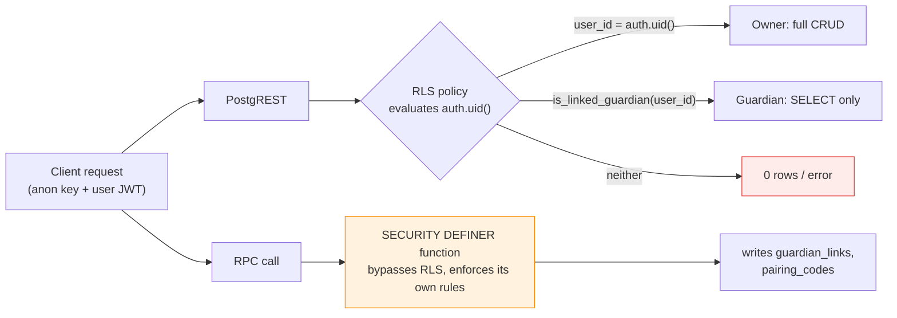

### Access matrix

| Table | Owner | Linked guardian | Anyone else | Written by |
|---|---|---|---|---|
| `profiles` | select, update own | select (patient↔guardian both directions) | — | client |
| `medicines` | all | **select** | — | client (owner) |
| `dose_history` | all | **select** | — | client (owner) |
| `health_readings` | all | **select** | — | client (owner) |
| `guardian_links` | select own side | select own side | — | **RPC only** — no write policy exists |
| `pairing_codes` | all own | — | — | **RPC only** in practice |
| `action_requests` | all own (approver) | select + **insert** (guarded by `is_linked_guardian`) | — | guardian inserts, patient updates |
| `subscriptions` | all own | — | — | client ⚠️ |
| `payment_methods` | all own | — | — | client |
| `plans` | select | select | select | seed SQL only |

### Why the privileged-function pattern

`guardian_links` has a *read* policy and no *write* policy. A client therefore cannot
insert a link at all — links exist only as a side effect of `pair_with_code`, which runs
with elevated rights and performs its own checks: authenticated, target exists, not
self, code hash matches, code unexpired and active, plan limit respected. `search_path`
is pinned on these functions to prevent schema-shadowing attacks.

This is the correct shape for any rule that must hold even against a modified client.

### The gap in the same pattern

`subscriptions` is fully client-writable by its owner, which means a determined user can
grant themselves the Family plan by inserting a row — and thereby raise their guardian
limit. This is acceptable while payments are a stub and everything is free, but it must
be closed **in the same sprint that real payments land**: revoke client write access and
let only a payment webhook (service role) mutate subscriptions.

---

## 5. Module M1 — Identity & Session

### Registration and login

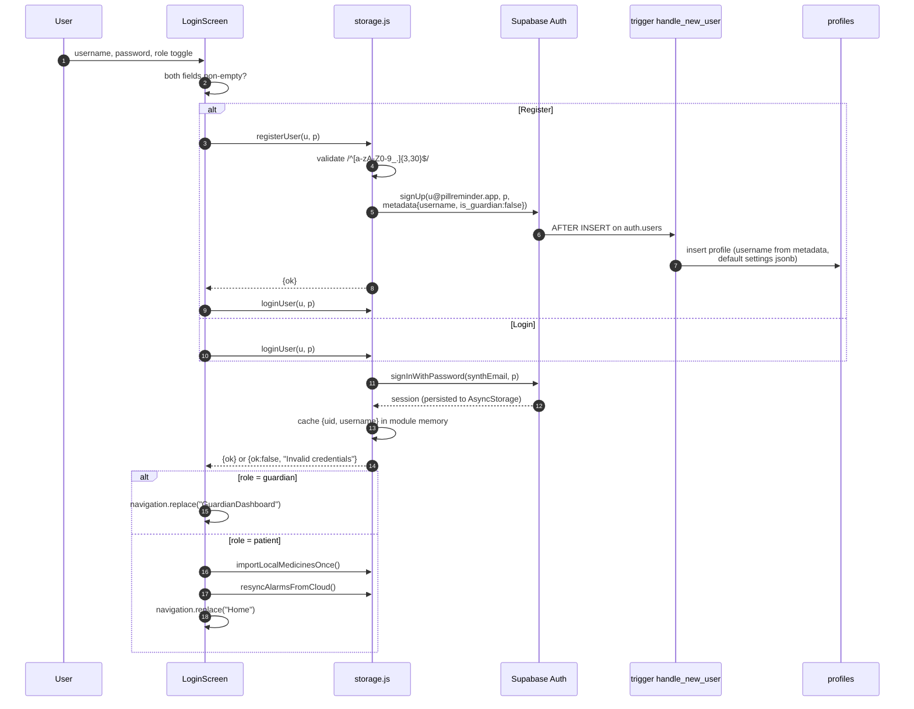

### Technical notes

- **`synthEmail(username)`** = `trim().toLowerCase() + "@pillreminder.app"`. Lower-casing
  makes usernames case-insensitive for auth. The pairing RPC independently compares
  `lower(username)`, so the two are consistent.
- **Profile creation is a database trigger, not a client insert.** If the client crashed
  between sign-up and profile creation, the account would be unusable; the trigger makes
  it atomic with the auth insert. It falls back to `user_<first 8 chars of uuid>` if
  metadata is missing, and is idempotent (`on conflict do nothing`).
- **Default settings ship in the column default** (`graceMinutes: 30`,
  `notifyMode: "missed"`, `approvalRequired: true`) so a fresh account is immediately
  safe without the client writing anything.
- **Session reads never hit the network.** `getSession()` and the internal `currentUid()`
  both read the locally persisted session — deliberate, because they are called on every
  screen focus and inside the background task.

### App boot sequence

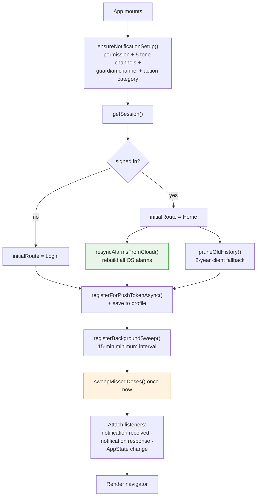

Note that push registration and the background sweep are set up **regardless of login
state** — any device may be a guardian, and a guardian's device needs a push token even
before its owner signs in on this launch.

---

## 6. Module M2/M3 — Medicine → Alarm pipeline

### Save flow, including the three modes

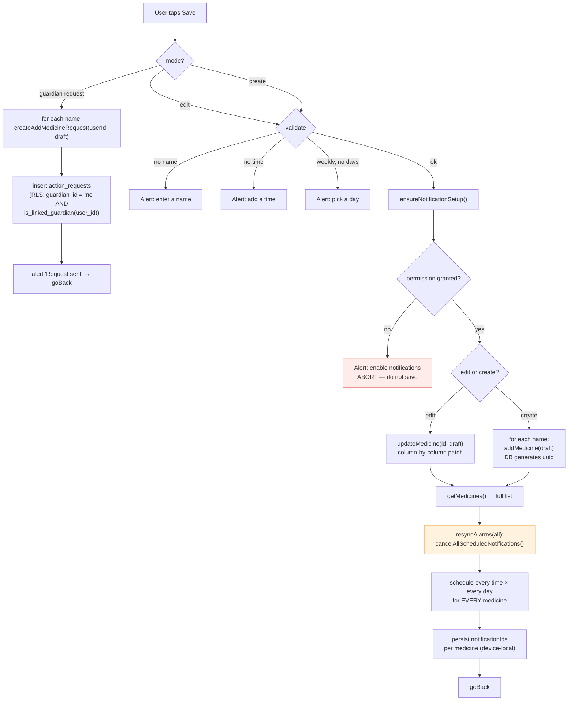

**Design point:** permission is checked *before* writing. Saving a medicine that can
never ring would be worse than refusing to save.

**Implementation detail worth knowing.** The create path builds a client-side id like
`1720000000000_0_a1b2c`, but the row mapper only forwards an `id` when it matches a UUID
pattern — so for new medicines the id is dropped and PostgreSQL generates the real one.
The client id is effectively dead code. On edit, the id *is* a UUID and is forwarded.

### Schedule expansion

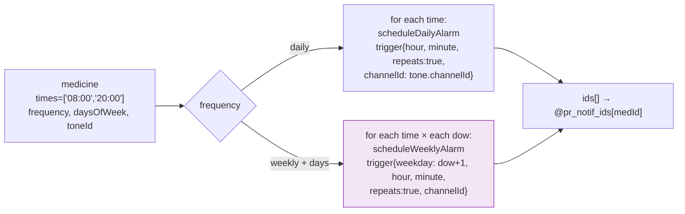

`weekday: dow + 1` is the JS→Expo calendar translation (`Date.getDay()` is 0-based Sunday;
Expo's weekday is 1-based Sunday). Cardinality: a weekly medicine with 2 times × 3 days
registers **6** OS triggers.

### Notification anatomy

| Field | Value | Purpose |
|---|---|---|
| `title` / `body` | "Time for your medicine" / "Take X now" | legible on a lock screen |
| `data` | `{medicineId, medicineName, type:'pill-alarm'}` | routing after a cold start |
| `sound` | tone's raw resource name | must match the channel's sound |
| `categoryIdentifier` | `pill-alarm-actions` | attaches Taken/Reschedule/Skip |
| `priority` | MAX | heads-up + full-screen candidacy |
| `sticky`, `autoDismiss:false` | true / false | an unanswered alarm stays visible |
| `vibrate` | `[0,800,400,800,400,800]` | matches the channel pattern |

### Channel strategy — the decision and the constraint

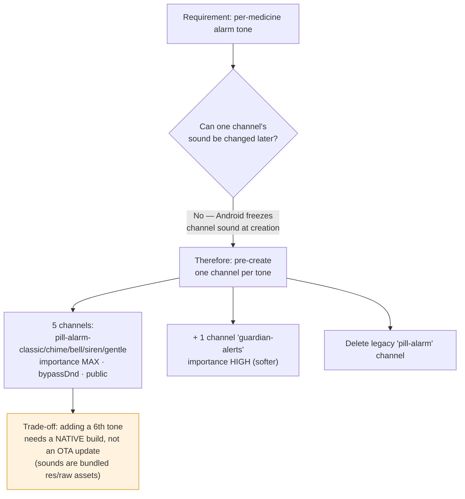

That trade-off is the reason tones are a fixed set of five bundled WAVs rather than
user-supplied files. A system-ringtone picker exists in the codebase (`ringtone.js`) but
is **not currently wired into any screen** — it was superseded by the bundled-tone
approach, because a user-picked URI cannot be attached to a pre-created channel's sound.

### Why full resync instead of surgical cancellation

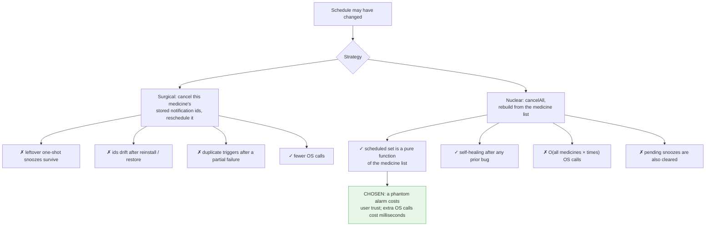

Resync is invoked from **five** places: app boot, login, after save, after delete, and
after approving a guardian request. `sync.js` wraps it as
`resyncAlarmsFromCloud()` = *read the cloud list (or cache) → cancel all → re-arm →
persist ids*, and it clears alarms outright when the account has no medicines.

---

## 7. Module M4/M5 — Dose response & state derivation

### Alarm fires → outcome recorded

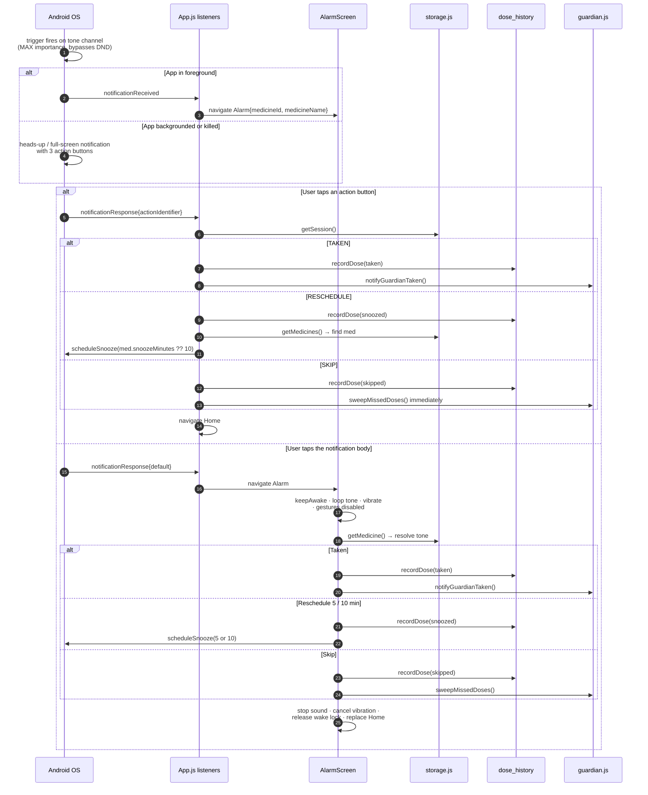

**Inconsistency to note:** the notification's Reschedule honours `med.snoozeMinutes`;
the alarm screen offers hard-coded 5 and 10 minute buttons. Both write the same
`snoozed` event, so detection stays correct, but the user-visible behaviour differs by
entry point.

### AlarmScreen technical decisions

| Concern | Implementation | Reason |
|---|---|---|
| Screen must stay lit | `activateKeepAwakeAsync('alarm')`, released on unmount | a dark screen defeats a visual alarm |
| Must not be dismissed by reflex | `gestureEnabled: false`, `headerShown: false`, exits use `replace` | back-swipe must not silently cancel a dose |
| Must be audible | `expo-av` looping at volume 1.0, `shouldDuckAndroid: false`, `interruptionModeAndroid: DoNotMix`, `staysActiveInBackground` | must not be ducked under music or a call tone |
| Tone must always play | try medicine's tone → on any failure, fall back to bundled `alarm.wav` | a silent alarm is the worst outcome |
| No leaked audio | a `cancelled` flag guards the async load; cleanup stops + unloads | fast navigation could otherwise orphan a looping sound |

### The state derivation function

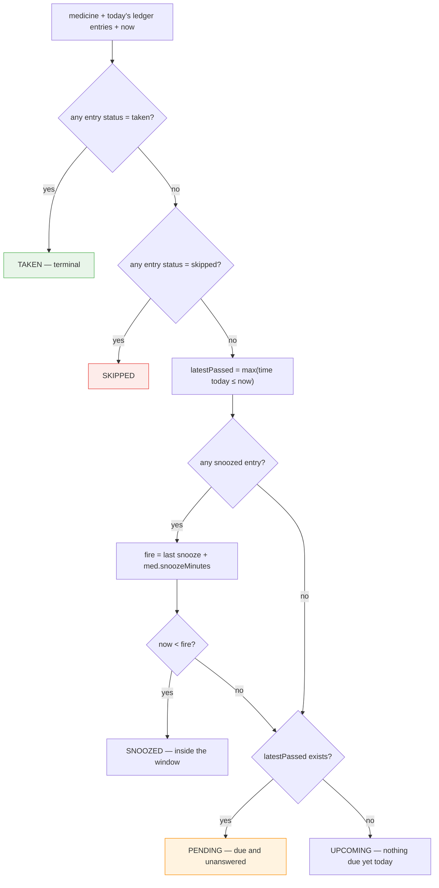

Precedence is what makes this deterministic: `taken` beats everything (so a dose taken
after a skip reads as taken), and the snooze window is only consulted when neither
terminal status is present.

### Home screen composition

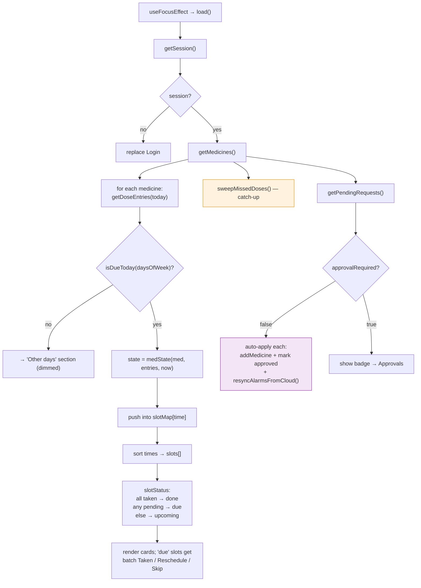

**Performance characteristic (known debt).** `load()` issues one `getDoseEntries` query
**per medicine** — an N+1 pattern. At 5–10 medicines on a warm connection this is
invisible; at 30+, or on a poor network, it is a visible stall, and it repeats on every
screen focus. The fix is one query for today's entries followed by client-side grouping.
Logged in the sprint plan as a Sprint 5 item.

---

## 8. Module M6 — Guardian pairing

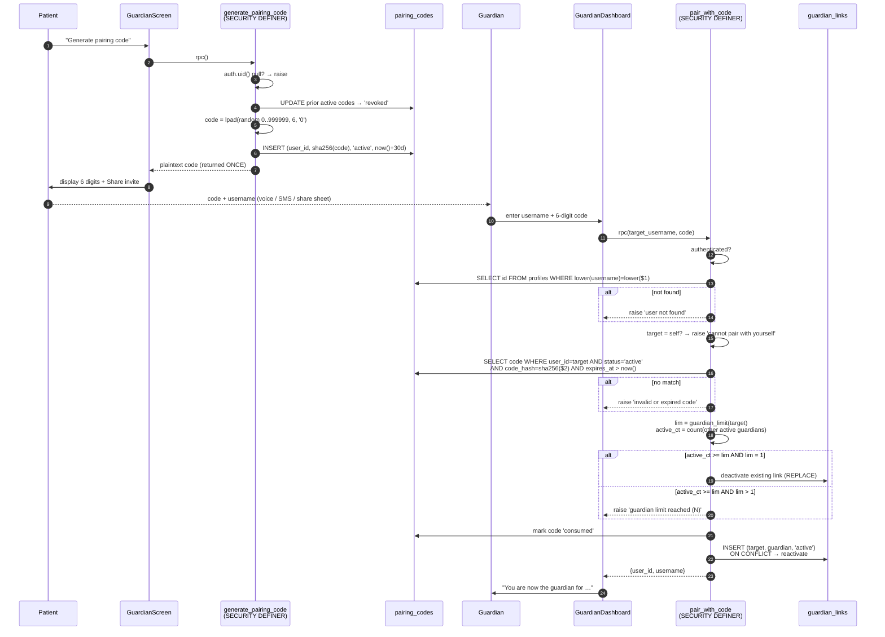

### Why each rule exists

| Rule | Threat or need it addresses |
|---|---|
| Code is hashed at rest | database or backup leak yields nothing usable |
| Plaintext returned exactly once | forces the code through the patient's own hands |
| Generating revokes prior codes | at most one live credential at any moment |
| 30-day expiry | bounds the window for a leaked code |
| Consumed on use | single-use; a shared screenshot cannot be replayed |
| Username **and** code required | two factors; the code alone identifies no account |
| Self-pair rejected | prevents a nonsensical self-referential link |
| `lim = 1` replaces rather than rejects | matches the mental model of "change my guardian" |
| Enforced in SQL, not JS | a patched client cannot forge or over-subscribe a link |
| `search_path` pinned | blocks schema-shadowing against a `SECURITY DEFINER` function |

### Entitlement resolution

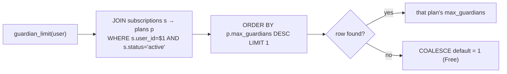

`ORDER BY max_guardians DESC` is deliberately generous: if a user somehow holds two
active subscriptions, they get the better limit rather than an arbitrary one.

**Migration note.** `schema.sql` originally created a partial unique index enforcing one
active guardian per user at the *database* level. `subscriptions.sql` **drops that
index** so multi-guardian plans can exist, moving enforcement entirely into
`pair_with_code`. Consequence: the limit now holds only for links created through the
RPC — which is all of them, because no write policy exists on `guardian_links`. The
invariant survives, but it now rests on the absence of a policy rather than on a
constraint. Any future write policy on that table must re-add an equivalent check.

### Revocation

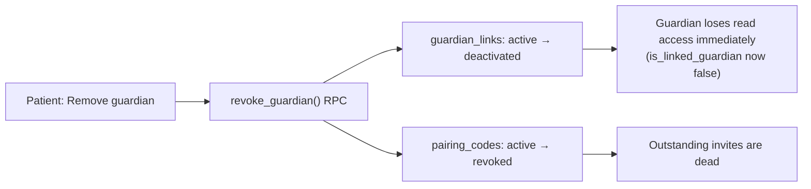

Access loss is immediate and needs no coordination with the guardian's device, because
every guardian read is re-evaluated against `is_linked_guardian` on each query.

---

## 9. Module M7 — Missed-dose detection

### The sweep

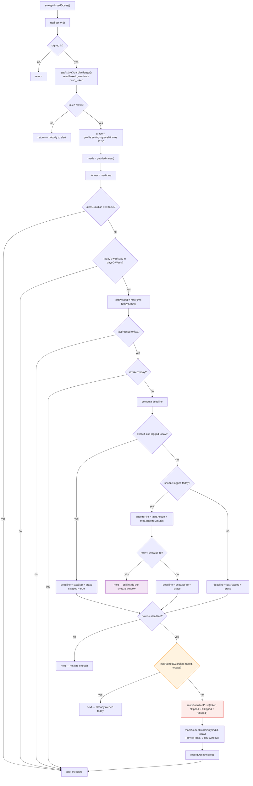

### Deadline decision table

| Ledger state today | Deadline | Alert wording | Rationale |
|---|---|---|---|
| `taken` present | — (never alert) | — | resolved |
| `skipped` present | `lastSkip + grace` | "skipped X and has not taken it" | a skip is a signal, not consent — but grace lets them reconsider |
| `snoozed`, re-alarm not yet due | — (skip this pass) | — | the patient is legitimately inside their own deferral |
| `snoozed`, re-alarm already passed | `snoozeFire + grace` | "has not taken X (due …)" | snooze moves the goalposts once, not indefinitely |
| nothing logged | `lastPassed + grace` | "has not taken X (due …)" | plain lateness |

`grace` is the patient's own setting (5/15/30/60, default 30). The whole function is
wrapped so it can never throw — it runs inside an OS background task, where a crash
costs future scheduling opportunities.

### Trigger redundancy

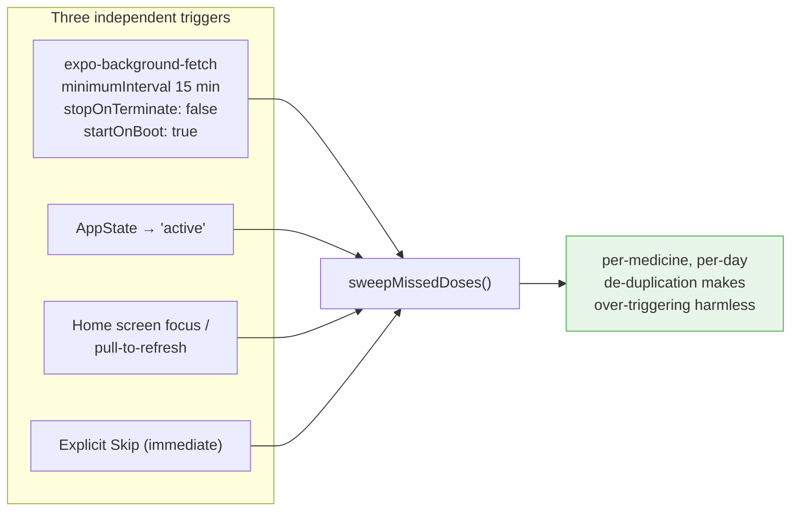

Redundant triggers are safe **only because** de-duplication is idempotent. That is the
load-bearing property: Android's background scheduler is best-effort and OEM battery
managers throttle it aggressively, so the app deliberately over-triggers and relies on
the dedup marks to keep the guardian's phone quiet.

The background task is registered with `TaskManager.defineTask` **at module load**, not
inside a component — the OS may relaunch the app headlessly to run the task, and the
handler must already be defined at import time or the task fails.

### The push path, and its structural weakness

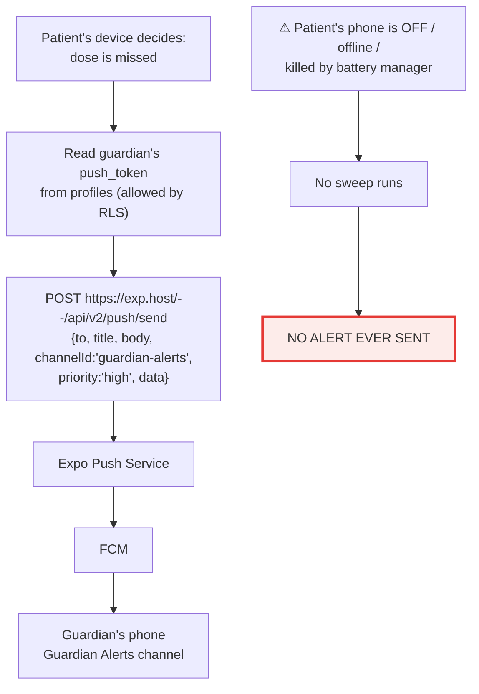

| Property | Assessment |
|---|---|
| No backend to build or run | ✓ shipped the feature fast, zero server cost |
| Works without any privileged key | ✓ Expo push needs no secret for unauthenticated sends |
| Requires the patient's device to be alive and online | ✗ **fails in exactly the scenario a guardian cares about most** |
| Patient's client handles the guardian's push token | ✗ token exposure; a modified client could spam that guardian |
| Delivery is unverified beyond Expo's synchronous ack | ✗ no retry, no audit trail |

**Target architecture** (Sprint 6): a scheduled server-side job evaluates the same rules
against `medicines` + `dose_history`, holds the push credential itself, records what it
sent, and revokes the client's need to read `push_token` at all. The client sweep can
remain as a fast-path optimisation, with dedup marks moved to a server table so both
paths share one idempotency key.

---

## 10. Module M8 — Approval workflow

```mermaid
sequenceDiagram
    autonumber
    participant G as Guardian
    participant GU as GuardianUserScreen
    participant AM as AddMedicineScreen<br/>(request mode)
    participant AR as action_requests
    participant P as Patient
    participant H as HomeScreen
    participant AP as ApprovalsScreen
    participant M as medicines

    G->>GU: open a linked patient
    GU->>AM: navigate {requestUserId, requestUsername}
    AM->>AM: title → "Request for @user";<br/>Save → "Send request"
    G->>AM: fill form, Send
    AM->>AR: INSERT {user_id, guardian_id, 'add_medicine', payload}
    Note over AR: RLS INSERT check:<br/>guardian_id = auth.uid()<br/>AND is_linked_guardian(user_id)
    AR-->>AM: ok → "Request sent for approval"

    P->>H: opens app (focus)
    H->>AR: getPendingRequests()  (RLS scopes to own rows)
    H->>P: profile.settings.approvalRequired?
    alt approvalRequired = false
        H->>M: addMedicine(payload) as OWNER
        H->>AR: status → 'approved'
        H->>H: resyncAlarmsFromCloud()
    else approvalRequired = true
        H->>P: orange banner "N requests to review"
        P->>AP: tap banner
        AP->>P: show name · form · times
        alt Approve
            P->>M: addMedicine(payload) as OWNER
            AP->>AR: status → 'approved'
            AP->>AP: resyncAlarmsFromCloud() → alarms live now
        else Reject
            AP->>AR: status → 'rejected'
        end
    end
```

### Technical decisions

| Decision | Why |
|---|---|
| Payload stored as `jsonb`, not a shadow medicine row | a proposal is not a medicine; keeps `medicines` free of unapproved data and lets the payload shape evolve |
| **The patient inserts the medicine**, never the guardian | ownership derives from the inserting session, so `user_id = auth.uid()` holds trivially and needs no special policy |
| Guardian has `SELECT` + `INSERT` but not `UPDATE` | a guardian can propose and watch, but cannot approve their own proposal |
| `resyncAlarmsFromCloud()` immediately after approval | otherwise the medicine exists but stays silent until the next app launch |
| Auto-apply path lives in `HomeScreen.load()` | it needs the patient's session to insert as owner, and Home is the guaranteed reconciliation point |

### Gaps

- No push to the patient when a request is created — discovery is poll-on-focus only.
- No notification back to the guardian on approve/reject; they must re-open the screen.
- `kind: 'edit_medicine'` exists in the schema but has no producer or consumer yet.

---

## 11. Module M9 — Health trackers

```mermaid
flowchart TD
    A["READING_TYPES: client-side registry"] --> B["bp: systolic, diastolic — mmHg"]
    A --> C["sugar: value — mg/dL"]
    A --> D["cholesterol: total, hdl, ldl — mg/dL"]
    A --> E["weight: value — kg"]
    A --> F["each type carries a format(v) fn<br/>for display, e.g. '120/80'"]

    G["TrackersScreen"] --> H["pick type → form re-renders<br/>to that type's fields"]
    H --> I["validate: every field numeric"]
    I --> J["addReading(type, values, note)<br/>INSERT jsonb + unit + measured_at"]
    J --> K["clear form, reload recent list"]

    L["HealthReportScreen"] --> M{"route.params.userId?"}
    M -->|"set (guardian view)"| N["getUserReadings(userId)<br/>allowed by guardian SELECT policy"]
    M -->|"absent (own view)"| O["getReadings()"]
    N --> P["group by type"]
    O --> P
    P --> Q["per field: latest, avg, min, max, count"]
    Q --> R["Share.share(plain text)<br/>→ WhatsApp / SMS / email"]

    style R fill:#e8f5e9,stroke:#4CAF50
    style N fill:#e0f2f1,stroke:#00796b
```

### Notes

- **Type definitions are client-side, values are schemaless.** Adding SpO₂ or HbA1c means
  appending to the registry and shipping an OTA JS update — no migration, no native
  build. The trade is that the database cannot validate a reading's shape.
- **One screen serves two audiences.** The report differs only by which user id it loads;
  the guardian's access is granted by RLS, not by a code branch. That is the cheap,
  correct way to build a shared view.
- **Bounded window (known limitation).** The report requests the most recent readings
  *across all types together* (default 60). A user who records blood pressure twice daily
  can push weight readings out of their own report. Per-type queries or a date-range
  filter is the fix.
- **`stats()` treats index 0 as "latest"**, which is correct only because queries order by
  `measured_at DESC`. That coupling is implicit and worth a comment or an explicit sort.

---

## 12. Module M10 — Plans & entitlement

```mermaid
flowchart TD
    A["PlansScreen"] --> B["getPlans() — public read, ordered by price"]
    A --> C["getMyPlan() — newest active subscription<br/>JOIN plans; default FREE"]
    D["User taps Subscribe"] --> E{"price_cents > 0?"}
    E -->|yes| F["startCheckout({planId, country:'IN'})"]
    F --> G["STUB → {ok:false, stub:true}"]
    E -->|no| H
    G --> H["activatePlanMock(planId)"]
    H --> I["UPDATE prior active subscriptions → 'canceled'"]
    I --> J["INSERT {plan_id, status:'active',<br/>auto_renew:false, current_period_end:+1 month}"]
    J --> K["Alert: 'Activated (test mode) —<br/>no charge was made'"]
    K --> L["Effect: guardian_limit(user) now returns<br/>that plan's max_guardians"]

    style G fill:#fff3e0,stroke:#fb8c00
    style K fill:#e8f5e9,stroke:#4CAF50
```

### Current state, stated plainly

| Aspect | Today |
|---|---|
| Enforced entitlement | **`max_guardians` only**, checked server-side inside `pair_with_code` |
| Advertised entitlements | trackers + 2-year history — **available on Free too**; the screen shows identical bullets for every tier |
| Charging | none; `startCheckout` returns a stub and the app activates anyway, disclosing test mode |
| Country routing | `providerForCountry`: IN → Razorpay, US/CA → Stripe, default Stripe |
| Country source | **hard-coded `'IN'`** at the call site |
| Auto-renew | a boolean column; no mandate, no renewal job |
| Write path | the **client** inserts subscription rows ⚠️ |

### Target payment architecture

```mermaid
sequenceDiagram
    autonumber
    participant C as Client
    participant EF as Edge Function<br/>(service role)
    participant PR as Razorpay / Stripe
    participant DB as subscriptions

    C->>EF: createOrder(planId, country)
    EF->>PR: create order / subscription
    PR-->>EF: order id
    EF-->>C: order id + public key
    C->>PR: native checkout (UPI / card)
    PR-->>C: client-side success
    PR->>EF: WEBHOOK payment.captured (signed)
    EF->>EF: verify signature — the only trusted signal
    EF->>DB: status='active', provider_ref,<br/>current_period_end, auto_renew
    C->>DB: poll / realtime → entitlement appears
    Note over DB: Client write access on<br/>subscriptions must be REVOKED<br/>in this same change
```

The essential inversion: today the client asserts entitlement; afterwards only a
signed webhook may grant it. Revoking the client's write policy on `subscriptions` is
part of the same change, not a follow-up.

---

## 13. Module M11 — Offline, caching & retention

```mermaid
flowchart TD
    A["getMedicines()"] --> B["SELECT * FROM medicines<br/>WHERE user_id = uid ORDER BY created_at"]
    B --> C{"success?"}
    C -->|yes| D["map rows → app shape<br/>+ merge device-local notificationIds"]
    D --> E["write @pr_meds_cache"]
    E --> F["return list"]
    C -->|"no (offline / error)"| G["read @pr_meds_cache"]
    G --> H["return cached list (or [])"]

    style G fill:#fff3e0,stroke:#fb8c00
```

### The cloud / device split, and why each item sits where it does

```mermaid
flowchart LR
    subgraph CLOUD["Supabase — shared, authoritative"]
        C1["profiles + settings"]
        C2["medicines"]
        C3["dose_history"]
        C4["health_readings"]
        C5["guardian_links · pairing_codes"]
        C6["action_requests"]
        C7["subscriptions"]
    end
    subgraph DEVICE["AsyncStorage — local, disposable"]
        D1["Supabase session"]
        D2["@pr_meds_cache"]
        D3["@pr_notif_ids"]
        D4["@pr_push_token"]
        D5["@pr_alerts_&lt;user&gt; (7-day dedup)"]
        D6["@pr_guardian_&lt;user&gt; (legacy)"]
    end
    C2 -. mirror .-> D2
    D4 -. copy .-> C1
    style D3 fill:#f3e5f5,stroke:#8e24aa
    style D5 fill:#f3e5f5,stroke:#8e24aa
```

| Item | Placement | Reason |
|---|---|---|
| Session | device | must be readable offline on every launch and inside the background task |
| Medicines | cloud + mirror | guardian must read them; mirror keeps the alarm screen functional offline |
| Notification ids | **device only** | an OS-scoped handle; meaningless on another phone |
| Push token | device **and** profile | needed locally, and by the paired patient to reach this guardian |
| Alert dedup marks | **device only** | ephemeral; bounded to 7 days ⚠ *see below* |
| `@pr_guardian_*` | device, legacy | pre-cloud guardian profile; superseded by `guardian_links` |

**Consequence of device-local dedup:** reinstalling the app, clearing data, or signing in
on a second device resets the marks, so one already-alerted medicine can alert a second
time. Harmless today; it becomes a genuine correctness requirement the moment a
server-side sweep exists, since both paths must share one idempotency key. Moving dedup
to a server table is bundled with Sprint 6.

**Writes are not queued.** Reads degrade gracefully; a dose recorded with no connection
is lost. An outbox with replay-on-reconnect is an open item.

### Retention

```mermaid
flowchart LR
    A["Retention policy: 2 years of dose history"] --> B["Primary: pg_cron nightly 03:00 UTC<br/>DELETE WHERE day < current_date - 2 years"]
    A --> C["Fallback: pruneOldHistory() on app start<br/>(current user's rows only)"]
    B --> D["⚠ ships COMMENTED OUT —<br/>needs pg_cron enabled in the dashboard"]
    style D fill:#fdecea,stroke:#e53935
```

Two years balances clinical usefulness against storage cost and privacy exposure. Until
the scheduler is enabled, the client fallback only prunes users who actually open the
app — abandoned accounts retain data indefinitely.

---

## 14. Navigation graph

```mermaid
flowchart TD
    L["Login<br/>(no header)"] -->|"patient"| H["Home<br/>(no header)"]
    L -->|"guardian"| GD["GuardianDashboard<br/>(no header)"]

    H --> AM["AddMedicine"]
    H --> G["Guardian<br/>(pairing + settings)"]
    H --> TR["Trackers"]
    H --> HR["HealthReport"]
    H --> PL["Plans"]
    H -->|"badge"| AP["Approvals"]
    H -->|"logout"| L

    GD --> GU["GuardianUser"]
    GD -->|"'My medicines'"| H
    GD -->|"logout"| L
    GU -->|"request mode"| AM
    GU --> HR

    N["Notification<br/>(body tap or action)"] --> AL["Alarm<br/>(no header, gestures OFF)"]
    AL -->|"replace"| H

    style AL fill:#1b5e20,color:#fff
    style GD fill:#e0f2f1,stroke:#00796b
    style H fill:#e8f5e9,stroke:#4CAF50
```

**Structural notes.** A single stack navigator, no tabs. Role switching uses `replace`,
so there is no back-stack leak between patient and guardian contexts. `Alarm` disables
gestures and its exits use `replace`, making it a one-way door. `AddMedicine` and
`HealthReport` are each shared by patient and guardian contexts, parameterised rather
than duplicated. Route-level auth is enforced imperatively: `HomeScreen.load()` bounces
to `Login` if the session has disappeared.

---

## 15. Cross-cutting technical decisions and why

| # | Decision | Alternative rejected | Reason |
|---|---|---|---|
| 1 | Expo managed workflow | bare React Native | notifications, background fetch, audio and cloud builds work out of the box; no Android Studio needed |
| 2 | Supabase as the whole backend | custom API server | RLS + `SECURITY DEFINER` RPCs cover the trust model with no server to operate |
| 3 | Synthetic emails for usernames | real email auth | the target audience may have no email; uniqueness comes free — at the cost of any recovery path |
| 4 | OS-scheduled notifications | in-app timers / foreground service | only the OS can ring reliably when the app is not running |
| 5 | One channel per tone | mutate a channel's sound | Android freezes channel sound at creation |
| 6 | Cancel-all-and-rebuild alarms | surgical id-level cancellation | eliminates phantom and duplicate alarms; trust > microseconds |
| 7 | Append-only dose ledger | mutable per-day status | required for snooze-aware deadlines and future analytics |
| 8 | State derived, never stored | a `state` column | one source of truth; time-dependent state cannot go stale |
| 9 | Hashed one-time pairing codes | deep links / QR | works over a phone call; usable by non-technical users; leak-resistant |
| 10 | Guardian proposes, patient approves | direct guardian writes | patient autonomy over their own alarms |
| 11 | Client-side push send | server-side push | no backend needed — **the main debt**, see §9 |
| 12 | Redundant sweep triggers | trust background fetch alone | OEM battery managers throttle background work; dedup makes over-triggering safe |
| 13 | Plans in the DB | plans in the binary | change pricing without an app release |
| 14 | Publishable key in the repo | secret + proxy | RLS is the real boundary; the key grants nothing by itself |
| 15 | Offline read cache, no write queue | full sync engine | alarms are the safety-critical path and they are OS-registered in advance |
| 16 | Background task defined at module load | defined in a component | the OS relaunches headlessly; the handler must exist at import time |
| 17 | Storage API shape frozen across the cloud migration | rewrite all screens | zero-churn migration — at the cost of vestigial `user` parameters |

---

## 16. Failure-mode analysis

| Failure | Detection | Current behaviour | Residual risk |
|---|---|---|---|
| No network on medicine read | try/catch | falls back to `@pr_meds_cache`; alarms unaffected | stale list until reconnect |
| No network on dose write | none | **write is lost** | adherence gaps; no retry |
| Notification permission denied | checked before save | save aborts with an explanatory alert | user may not understand the setting |
| OEM battery manager kills the app | none in-app | background sweep silently stops | **no guardian alert** — README-only mitigation |
| Patient's phone off at deadline | none | no sweep, no push | **no alert in the highest-risk scenario** |
| Tone asset fails to load | try/catch in AlarmScreen | falls back to bundled `alarm.wav` | slightly wrong tone, still audible |
| Expo push rejects the token | response status inspected | returns `false`; already marked as alerted | that day's alert is lost silently |
| Device reboot | `startOnBoot: true` + boot permission | alarms re-armed on next launch; task re-registered | window between boot and first launch |
| Stale/duplicate alarms | — | cancel-all-and-rebuild on every mutation | pending snoozes are also cleared |
| Guardian revoked mid-session | RLS re-evaluated per query | reads return zero rows immediately | guardian's UI may show cached data until refresh |
| Two devices, same patient | — | notification ids diverge per device; both re-arm on launch | dedup marks are per-device → duplicate guardian alerts possible |
| Background task throws | wrapped in try/catch returning `Failed` | swallowed; OS keeps the registration | a systematic error is invisible without telemetry |
| Non-UTC timezone | none | `day` keys computed in UTC | ledger day boundary shifted (e.g. 05:30 IST) |
| Client forges a subscription | none | insert succeeds under the owner policy | free entitlement escalation until webhooks land |

---

## 17. Known architectural debt

Ordered by risk × effort. Sprint assignments live in
[`03-sprint-plan.md`](./03-sprint-plan.md).

1. **Client-side missed-dose detection** (§9) — the safety feature does not work when
   the patient's phone is off. *Move the sweep server-side; move dedup to a server
   table.*
2. **No account recovery** (§5) — synthetic emails make password reset impossible.
   *Add optional real email or phone OTP as a recovery factor.*
3. **UTC day keys with local dose times** (§3) — shifted ledger boundaries outside UTC.
   *Compute the local date, or store `tz` and derive `day` server-side.*
4. **Client-writable `subscriptions`** (§4, §12) — entitlement can be self-granted.
   *Revoke the write policy in the same change that adds payment webhooks.*
5. **N+1 dose-entry queries on Home** (§7) — one query per medicine on every focus.
   *One query for today, group client-side.*
6. **No offline write queue** (§13) — doses recorded offline are lost. *Outbox +
   replay.*
7. **Guardian limit rests on the absence of a write policy** (§8) — the enforcing index
   was dropped. *Re-add a DB-level guard or a trigger.*
8. **No automated tests anywhere** — the deadline/state rules are pure functions and
   ideal unit-test targets, yet untested. *Extract and test them first.*
9. **Vestigial `user` parameters across `storage.js`** (§2) — misleading API surface.
   *Mechanical cleanup.*
10. **Undifferentiated plan tiers** (§12) — paid features are free. *Product decision
    then enforcement.*
11. **Dead code**: `ringtone.js` is unwired; `CHANNEL_ID` in `notifications.js` is
    unused; the client-generated medicine id is always discarded. *Delete or wire up.*
12. **iOS is unconfigured** — no bundle identifier, and the full-screen alarm model does
    not exist on iOS. *Explicit platform decision needed.*
