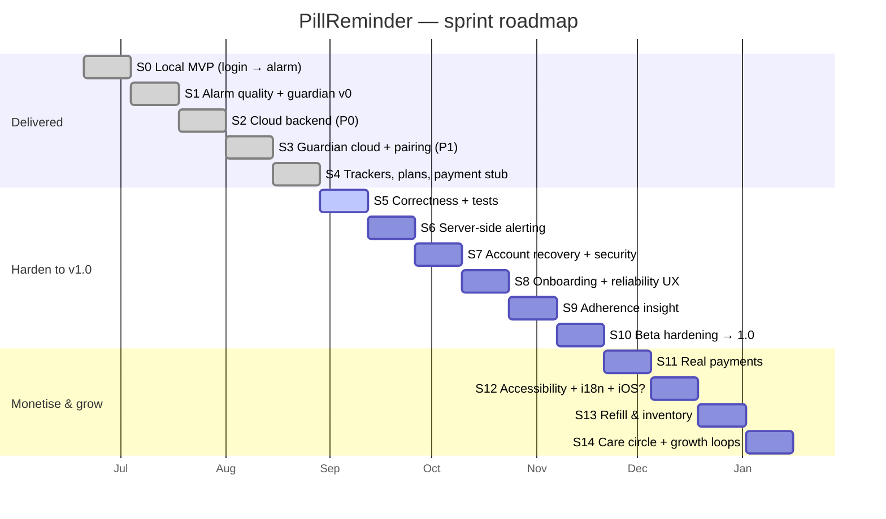
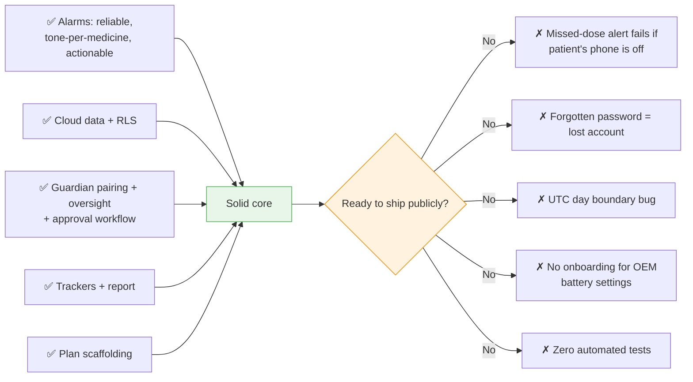
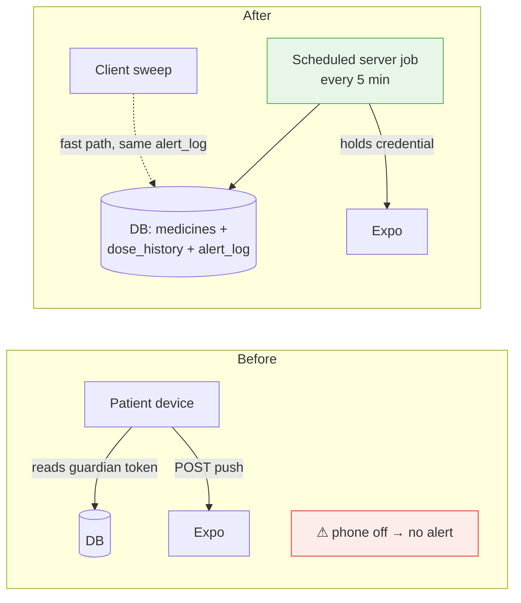

# PillReminder — Complete Development Plan (Sprint Model)

> **Purpose.** The whole project as a sequence of sprints: from the first login screen
> through to a monetised, store-ready product. Sprints 0–4 are **already delivered** and
> documented retrospectively so the plan reads end-to-end. Sprints 5 onward are the
> forward plan.
>
> **Working assumptions** — adjust to your reality:
> - 2-week sprints, small team (1–2 devs, part-time design/QA).
> - Capacity ≈ **20 story points** per sprint. Points are relative (1 ≈ half a day).
> - Android-first. iOS is an explicit decision point at Sprint 12.
> - Delivered scope confirmed against commits `0194239` → `e8dd794`.

---

## Contents

- [Roadmap at a glance](#roadmap-at-a-glance)
- [Release train](#release-train)
- [Part I — Delivered (Sprints 0–4)](#part-i--delivered-sprints-04)
- [Part II — Forward plan (Sprints 5–14)](#part-ii--forward-plan-sprints-514)
- [Definition of Ready / Done](#definition-of-ready--definition-of-done)
- [Ceremonies & rituals](#ceremonies--rituals)
- [Metrics per sprint](#metrics-to-review-every-sprint)
- [Risk register](#risk-register)
- [Backlog not yet scheduled](#backlog-not-yet-scheduled)

---

## Roadmap at a glance

## Release train

| Release | After | Contents | Channel |
|---|---|---|---|
| `0.4.x` | S4 | current internal build | EAS `preview` |
| **`0.9.0` Closed beta** | S8 | correct, recoverable, server-alerted, onboarded | `preview`, ~20 real households |
| **`1.0.0` Play Store** | S10 | public launch, free tier only | `production` |
| `1.1.0` | S11 | paid tiers live | `production` |
| `1.2.0` | S12 | accessibility, Hindi/Telugu, iOS decision | `production` |
| `1.3.0` | S14 | care circle, growth loops | `production` |

---

# Part I — Delivered (Sprints 0–4)

## Sprint 0 — Local MVP: login to ringing alarm

**Goal.** One person can register on a phone, add a medicine, and be woken by it.

| Story | Delivered |
|---|---|
| Register/login with username + password | `LoginScreen`, local AsyncStorage auth |
| Add a medicine with one or more daily times | `AddMedicineScreen`, quick-add chips, wheel picker |
| Be alarmed at each time | `expo-notifications` daily repeating triggers |
| Answer the alarm | `AlarmScreen` — Taken / Snooze / Skip |
| See today's status | `HomeScreen` list with taken markers |
| Delete a medicine | long-press |
| Install on a real phone | EAS `preview` APK |

**Key decisions.** Expo managed workflow. OS-scheduled notifications, not in-app timers.
Local-only auth to reach a testable build fastest.

**Exit criteria met.** An alarm fires at the right minute on a locked screen; a marked
dose turns green; the APK installs from a link.

---

## Sprint 1 — Alarm quality and guardian v0

**Goal.** Make the alarm unmissable and unignorable, and prove the guardian idea.

| Story | Delivered |
|---|---|
| Choose an alarm tone per medicine | 5 bundled WAVs, 5 Android channels, tap-to-preview |
| Alarm behaves like an alarm | MAX importance, `bypassDnd`, wake lock, looping audio, `DoNotMix`, disabled back gesture |
| Weekly regimens | `frequency` + `DaysSelector` (0=Sun…6=Sat), weekly triggers |
| Configurable snooze | 5/10/15/30 min, one-shot reschedule |
| Medicine type and colour | 5 forms, 8 colour swatches for at-a-glance recognition |
| Batch add | many names sharing one schedule |
| Alarm actions in the shade | `pill-alarm-actions` category — Taken / Reschedule / Skip |
| Guardian alerted on a missed dose | first `sweepMissedDoses()`, Expo push, device-local guardian record |
| Survive reboot / app death | background fetch task, `startOnBoot`, resync on launch |
| Never fire a phantom alarm | **cancel-all-and-rebuild** resync strategy |

**Key decisions.** One channel per tone (Android freezes channel sound at creation).
Cancel-all-and-rebuild over surgical cancellation. Append-only dose log — the enabler
for snooze-aware deadlines.

**Exit criteria met.** Tone selection works per medicine; a deliberately missed dose
alerts a second phone; no duplicate alarms after repeated edits.

---

## Sprint 2 — Cloud backend (P0) · commit `0194239`

**Goal.** Move identity and data off the device so a guardian can ever see them.

| Story | Delivered |
|---|---|
| Real accounts | Supabase Auth via synthetic `username@pillreminder.app` |
| Profile per account | `profiles` + `handle_new_user` trigger, default settings jsonb |
| Medicines and history in the cloud | `medicines`, `dose_history` tables |
| Nobody reads anyone else's data | RLS on every table; owner policies; `is_linked_guardian()` helper |
| Alarms still work offline | `@pr_meds_cache` mirror with fallback-on-error |
| Existing users keep their data | `importLocalMedicinesOnce()`, guarded on an empty cloud list |
| Alarms work on a new device | `resyncAlarmsFromCloud()` on login and boot |
| Screens don't need rewriting | `storage.js` exports kept signature-compatible |

**Key decisions.** Supabase instead of a custom API — RLS plus privileged functions
cover the trust model with no server to operate. Notification ids stay device-local.
Ship the publishable key; RLS is the boundary.

**Exit criteria met.** Same account on two phones shows the same medicines; a second
account sees nothing of the first; airplane mode still rings.

**Debt logged.** Vestigial `user` parameters; UTC day keys; N+1 dose queries.

---

## Sprint 3 — Guardian in the cloud + pairing (P1) · commits `f3c979d`, `e1c76c2`

**Goal.** Two accounts, safely linked, with patient consent as the primitive.

| Story | Delivered |
|---|---|
| Sign in as a guardian | role toggle on Login → `GuardianDashboard` |
| Link without typing a UUID | 6-digit code + username; `generate_pairing_code` / `pair_with_code` |
| Codes can't leak usefully | SHA-256 at rest, plaintext returned once, 30-day expiry, single-use, prior codes revoked |
| Guardian sees the medicine list | `GuardianUserScreen` via the guardian SELECT policy |
| Patient controls the relationship | grace period, notify-on-taken, require-approval, revoke |
| One guardian per patient | partial unique index + RPC deactivation of the prior link |
| Guardian can propose a medicine | `action_requests` + request mode on the medicine form |
| Patient approves or rejects | `ApprovalsScreen`, Home badge, insert-as-owner, resync alarms |
| Optional auto-apply | `approvalRequired: false` path in `HomeScreen.load()` |
| Alerts land on the right channel | separate softer `guardian-alerts` channel |

**Key decisions.** All pairing logic in `SECURITY DEFINER` SQL with pinned `search_path`
— a patched client cannot forge a link. Guardian gets SELECT + INSERT-request only,
never UPDATE on a patient's data. The **patient's session** performs the medicine insert
on approval, so ownership is trivially correct.

**Exit criteria met.** Pairing succeeds on the right code and fails on wrong username,
wrong code, expired code, reused code and self-pair; revoking cuts guardian reads
immediately.

---

## Sprint 4 — Trackers, report, retention, plans, payment stub (P2–P4) · commit `e8dd794`

**Goal.** Broaden from "pill alarm" to "health companion", and put the commercial
scaffolding in place.

| Story | Delivered |
|---|---|
| Record vitals | `health_readings`, 4 types, jsonb values, notes, `TrackersScreen` |
| Summarise them | `HealthReportScreen` — latest / avg / min / max / count per field |
| Share with a doctor | plain-text `Share.share()` |
| Guardian sees the report | same screen, `userId` param, guardian SELECT policy |
| Bound data growth | 2-year retention: pg_cron job (shipped commented) + client `pruneOldHistory()` |
| Plan catalogue | `plans` table, Free / Plus ₹99 / Family ₹199, public read |
| Multi-guardian tiers | `guardian_limit()`; `pair_with_code` rewritten to honour it; strict index dropped |
| Plans UI | `PlansScreen` with current plan and mock activation |
| Payment scaffolding | `payments.js` stub, Razorpay(IN)/Stripe(US,CA) routing, `subscriptions` + `payment_methods` tables |
| Honest test mode | "Online payment isn't enabled yet — no charge was made" |

**Key decisions.** `jsonb` values so new vital types need no migration. Plans in the DB
so pricing changes without an app release. Ship the stub visibly rather than fake a
charge.

**Exit criteria met.** Readings persist and appear in the report; a guardian can view a
linked patient's report; pairing respects the active plan's limit.

**Debt logged.** Client-writable `subscriptions`; undifferentiated tiers; retention job
not enabled; report window shared across types.

---

### Where the product stands entering Sprint 5

Sprints 5–10 exist to turn every ✗ into a ✓.

---

# Part II — Forward plan (Sprints 5–14)

## Sprint 5 — Correctness, test harness, and cleanup

**Sprint goal.** *Make the rules provably right and put a safety net under them, before
building anything on top.*

**Why now.** The deadline and state-derivation rules are the product's brain and are
entirely untested. Every later sprint touches them.

| ID | Story | Pts |
|---|---|---|
| 5.1 | **Fix the UTC day boundary.** Compute `day` from the device's local date; add `timezone` to `profiles`, populated at login. Backfill decision documented (no retro-migration; note the seam). | 3 |
| 5.2 | **Test harness.** Jest + `@testing-library/react-native`; `npm test` in CI on every push. | 3 |
| 5.3 | **Extract pure logic** into `src/domain/` — `medState`, `isDueToday`, `computeDeadline`, `expandSchedule` — no I/O. | 3 |
| 5.4 | **Unit-test the rules** — target ≥90% on `src/domain/`. Table-driven cases: taken-after-skip, snooze inside/outside window, skip + grace, weekly non-due day, multiple times, midnight and DST edges. | 5 |
| 5.5 | **Fix the N+1 on Home** — one `dose_history` query for today, grouped client-side. | 2 |
| 5.6 | **Align reschedule durations** — alarm screen offers the medicine's snooze setting (plus one alternative). | 1 |
| 5.7 | **Cleanup** — drop vestigial `user` params, delete unused `CHANNEL_ID`, delete or wire `ringtone.js`, remove the discarded client-side medicine id. | 2 |
| 5.8 | **Enable the retention job** — turn on `pg_cron`, uncomment and verify the nightly prune. | 1 |

**Acceptance criteria**
- A dose logged at 01:00 IST files under that local date, on-device and in the ledger.
- `npm test` runs in CI; the suite fails if any deadline rule regresses.
- Home issues **2** queries regardless of medicine count (medicines + today's doses).
- No behavioural change is visible to a user apart from the day-boundary fix.

**Definition of Done.** Coverage report published; timezone note added to
`02-architecture.md` §3; retention job verified by inserting and pruning a synthetic
3-year-old row.

**Risks.** Timezone changes touch three modules — land 5.1 first, alone, with tests.

---

## Sprint 6 — Server-side missed-dose alerting

**Sprint goal.** *A guardian is alerted even when the patient's phone is off.*

**Why now.** This is the product's core promise, and today it silently fails in its most
important scenario ([`02-architecture.md`](./02-architecture.md) §9).

| ID | Story | Pts |
|---|---|---|
| 6.1 | **Server sweep function** — scheduled every 5 min; ports `computeDeadline` to SQL/TS; evaluates all users with an active guardian link. | 8 |
| 6.2 | **Server-side dedup** — `alert_log(user_id, medicine_id, day, kind, sent_at)` with a unique key; the single idempotency source for both paths. | 3 |
| 6.3 | **Server holds the push credential** — Expo access token in function secrets; delivery receipts checked; failures retried once. | 3 |
| 6.4 | **Revoke the client's need for `push_token`** — remove the patient's read of the guardian's profile token; tighten the `profiles` SELECT policy accordingly. | 2 |
| 6.5 | **Client sweep becomes a fast path** — keeps working for instant feedback, writes to the same `alert_log`, so no duplicate can be sent. | 2 |
| 6.6 | **Observability** — log every evaluation and send; a simple daily counters query (evaluated / alerted / failed). | 2 |

**Acceptance criteria**
- Patient's phone powered **off** through a dose deadline → guardian is still alerted
  within 5 minutes of the deadline.
- Server and client both evaluating the same overdue dose produce **exactly one** push.
- Client code no longer reads any other profile's `push_token`.
- Snooze, skip and grace semantics are byte-identical between the two implementations
  (verified by a shared fixture suite).

**Definition of Done.** 48-hour soak with three test households; `alert_log` shows zero
duplicates; runbook for a failed scheduled run.

**Risks.** *Rule drift between two implementations* → share the fixture set and assert
both against it in CI. *Cost/quotas* → alert volume is bounded by dedup.

---

## Sprint 7 — Account recovery and security hardening

**Sprint goal.** *Nobody can permanently lose their account, and nobody can escalate
their own entitlement.*

| ID | Story | Pts |
|---|---|---|
| 7.1 | **Optional recovery contact** — add a real email or phone at any time; verified by OTP; stored on the profile. Never mandatory. | 5 |
| 7.2 | **Forgot password** — OTP to the recovery contact → password reset. Clear messaging when no contact is set. | 5 |
| 7.3 | **Recovery prompt** — a dismissible one-time nudge after the first medicine is added ("add a way to recover your account"). | 2 |
| 7.4 | **Lock down `subscriptions`** — revoke the client write policy; only the service role may mutate. Move mock activation behind a debug-only function. | 3 |
| 7.5 | **Re-add a DB guard on the guardian limit** — trigger on `guardian_links` re-checking `guardian_limit()`, so the invariant no longer rests on a missing policy. | 2 |
| 7.6 | **Rate-limit pairing attempts** — max 5 failed `pair_with_code` calls per guardian per hour; 6-digit codes are brute-forceable otherwise. | 3 |

**Acceptance criteria**
- A user with a verified recovery contact can reset their password end-to-end.
- A user without one sees an honest explanation, not a dead form.
- A client attempting to insert a subscription row is **rejected by policy**.
- The 6th wrong pairing attempt in an hour is rejected with a cooldown message.

**Definition of Done.** Security review of every RLS policy and RPC recorded in
`02-architecture.md` §4; brute-force test demonstrates the rate limit.

**Risks.** OTP delivery cost and deliverability in India → evaluate provider in
refinement; email-only fallback is acceptable for 0.9.0.

---

## Sprint 8 — Onboarding and reliability UX → **0.9.0 closed beta**

**Sprint goal.** *A first-time, non-technical user reaches a working alarm without help
— and finds out immediately if the phone will sabotage it.*

**Why now.** The top real-world failure ("my alarm didn't ring") is a device-settings
problem currently documented only in the README.

| ID | Story | Pts |
|---|---|---|
| 8.1 | **Guided first run** — 4 screens: what the app does → notification permission → exact-alarm permission → battery-unrestricted (deep-linked per OEM: Xiaomi, Oppo, Vivo, Samsung, Realme, generic). | 5 |
| 8.2 | **Health check card** on Home — traffic-light status for notifications, exact alarms, battery restriction, background refresh; each row taps through to the right system screen. | 5 |
| 8.3 | **"Test my alarm" button** — fires a real alarm in 30 seconds through the whole pipeline; the single best confidence-builder, and it verifies the user's own device. | 2 |
| 8.4 | **Empty and error states** — every screen gets a real empty state and a retry affordance instead of a silent blank. | 3 |
| 8.5 | **First-medicine flow** — after registration, land directly on Add Medicine with an explanatory header. | 2 |
| 8.6 | **Guardian invite polish** — copy-to-clipboard, QR of `username + code` as an alternative to reading digits aloud. | 3 |

**Acceptance criteria**
- Five people who have never seen the app add a medicine and hear it ring, unaided.
- On a Xiaomi device the battery step deep-links to the correct settings page.
- The health check correctly reports a **red** state when notifications are disabled.

**Definition of Done.** `0.9.0` on the `preview` channel with ~20 real households; a
feedback channel and a triage rota exist.

---

## Sprint 9 — Adherence insight (the guardian's missing half)

**Sprint goal.** *Turn the ledger the app has been faithfully writing into something a
patient and a guardian can actually see.*

**Why now.** The data and the permissions already exist; only the views are missing —
unusually high value per point.

| ID | Story | Pts |
|---|---|---|
| 9.1 | **Adherence history screen** — calendar heat map (per day: fully taken / partial / missed) + per-medicine adherence % over 7 / 30 / 90 days. | 8 |
| 9.2 | **Guardian sees adherence** — same screen for a linked patient (RLS already permits it). | 2 |
| 9.3 | **Weekly digest push** — Sunday summary to patient and guardian: "8 of 8 doses this week" / "Amma missed 3 doses this week". | 3 |
| 9.4 | **Streaks and encouragement** — current streak, best streak; positive-only framing, no shaming. | 3 |
| 9.5 | **Vitals trend charts** — simple line chart per tracker type over the selected range. | 3 |
| 9.6 | **Per-type report windows** — fix the shared-limit truncation from Sprint 4. | 1 |

**Acceptance criteria**
- Adherence % matches a hand-computed figure on a seeded fixture account.
- A guardian sees the patient's adherence without any new policy change.
- The weekly digest respects the patient's notify preferences.

**Definition of Done.** Charts legible at the largest system font size; no chart relies on
colour alone to convey state.

---

## Sprint 10 — Beta hardening → **1.0.0 Play Store**

**Sprint goal.** *Ship publicly, free tier only, with the operational ability to know
what is happening.*

| ID | Story | Pts |
|---|---|---|
| 10.1 | **Triage beta feedback** — fix the top issues from 0.9.0; explicit "no new features" budget. | 5 |
| 10.2 | **Crash and error reporting** — Sentry (or equivalent), release-tagged, PII-scrubbed. | 3 |
| 10.3 | **Product analytics** — a minimal, privacy-respecting event set: registered, medicine added, alarm fired, dose answered (by outcome), guardian paired, alert sent. | 3 |
| 10.4 | **Play Store readiness** — privacy policy, data-safety declaration, health-app disclosures, screenshots, store listing, `production` channel, signed AAB. | 5 |
| 10.5 | **Legal and safety copy** — "not a medical device", "not a substitute for professional advice"; visible at onboarding and in settings. | 2 |
| 10.6 | **Account deletion** — in-app delete with cascade; a Play Store requirement and the right thing regardless. | 3 |

**Acceptance criteria**
- Play Store internal-testing review passes.
- Crash-free session rate ≥ 99.5% across the beta cohort.
- Account deletion removes every row across all tables (verified by query).

**Definition of Done.** `1.0.0` live; on-call/rollback runbook (OTA revert + previous
APK) written and rehearsed once.

---

## Sprint 11 — Real payments

**Sprint goal.** *Take money correctly, and grant entitlement only on a verified signal.*

| ID | Story | Pts |
|---|---|---|
| 11.1 | **Decide the paywall** — which capabilities are genuinely paid. Recommended: Free = 1 guardian, 1 tracker type, 30-day history; Plus = 3 guardians, all trackers, full history, digests; Family = 5 guardians + multi-patient guardian dashboard. | 2 |
| 11.2 | **Enforce entitlements server-side** — a single `entitlements(user)` function consulted by every gated path; client only *displays* the result. | 5 |
| 11.3 | **Razorpay checkout (India)** — order creation in an Edge Function, native checkout, UPI + cards. | 5 |
| 11.4 | **Signed webhooks** — the only path that flips a subscription to active; sets `provider_ref` and `current_period_end`. | 5 |
| 11.5 | **Auto-renew** — UPI AutoPay / e-NACH mandate; cancel and lapse handling; `past_due` state. | 5 |
| 11.6 | **Country detection** — replace the hard-coded `'IN'` with locale/SIM/user choice; Stripe path for US/CA behind a flag. | 2 |
| 11.7 | **Billing UX** — receipts, current period, cancel flow, grace on failed renewal, restore purchases. | 3 |

**Acceptance criteria**
- No entitlement is ever granted by a client-side claim (verified by attempting it).
- A test payment moves the subscription to active **only** after the webhook is verified.
- Cancelling stops renewal and downgrades cleanly at period end — and a patient over the
  new guardian limit keeps existing links rather than losing access abruptly.

**Definition of Done.** Refund and dispute path documented; downgrade rules explicit.

**Risks.** *Store billing policy* — Google Play requires Play Billing for in-app digital
goods; confirm before implementing a third-party gateway. **Resolve this in refinement,
not in the sprint** — it may reshape 11.3–11.5 entirely.

---

## Sprint 12 — Accessibility, localisation, and the iOS decision

**Sprint goal.** *Make the app usable by the people who need it most, in their own
language.*

| ID | Story | Pts |
|---|---|---|
| 12.1 | **Accessibility audit + fixes** — labels on every control, ≥48dp targets, contrast ≥4.5:1, screen-reader passes on all flows, no colour-only meaning. | 5 |
| 12.2 | **Large-text mode** — respect system font scaling without clipping; an in-app "extra large" option. | 3 |
| 12.3 | **i18n framework + Hindi + Telugu** — externalise all strings; RTL-safe layouts for later. | 5 |
| 12.4 | **Voice confirmation (explore)** — speak the medicine name and instruction when the alarm screen opens; a genuine win for low-vision users. | 3 |
| 12.5 | **iOS decision spike** — document what a full-screen alarm can and cannot do on iOS (critical alerts require Apple entitlement); recommend go / no-go with cost. | 3 |
| 12.6 | **Dark mode** | 2 |

**Acceptance criteria**
- TalkBack completes add-medicine and answer-alarm end to end.
- Hindi and Telugu builds show no clipped or untranslated strings on the main flows.
- The iOS spike ends in a written recommendation, not an open question.

---

## Sprint 13 — Refill and inventory

**Sprint goal.** *Never run out of a medicine — the most-requested feature in this
category.*

| ID | Story | Pts |
|---|---|---|
| 13.1 | **Stock tracking** — pills on hand per medicine, decremented on each `taken`. | 5 |
| 13.2 | **Low-stock alerts** — configurable threshold in days; notify patient and guardian. | 3 |
| 13.3 | **Refill reminders** — projected run-out date; "order by" reminder. | 3 |
| 13.4 | **Prescription capture** — photo of a prescription attached to a medicine (Supabase Storage, owner + linked-guardian read). | 5 |
| 13.5 | **Doctor and pharmacy contacts** — per medicine; one-tap call. | 3 |

**Acceptance criteria**
- Marking a dose taken decrements stock; a manual correction is possible.
- The projected run-out date matches a hand-computed figure for daily and weekly regimens.

---

## Sprint 14 — Care circle and growth loops

**Sprint goal.** *Every new user brings someone with them, and one guardian can look
after several people well.*

| ID | Story | Pts |
|---|---|---|
| 14.1 | **Multi-patient guardian dashboard** — one screen, all patients, today's status at a glance, red first. | 5 |
| 14.2 | **Roles in the care circle** — viewer / helper / manager on `guardian_links.permissions` (the column already exists). | 5 |
| 14.3 | **Guardian-initiated invite** — a guardian sets up an account *for* a parent and invites them; reverses the funnel for the least tech-confident users. | 5 |
| 14.4 | **Shareable adherence card** — an image summary for family chat; the natural viral loop for this product. | 3 |
| 14.5 | **In-app referral** — "invite a family member" with attribution. | 2 |

**Acceptance criteria**
- A guardian with 5 patients sees all of them, sorted by urgency, in one screen.
- A helper-role guardian can act where a viewer-role guardian cannot.

---

## Definition of Ready / Definition of Done

**Ready** (before a story enters a sprint)
- Value stated in one sentence naming the beneficiary.
- Acceptance criteria written and testable.
- Design or copy attached when user-visible.
- Data-model and RLS impact identified.
- Estimated by the people who will build it.

**Done** (before a story leaves)
- Acceptance criteria demonstrably met on a real device.
- Unit tests for any new pure logic; regression test for any bug fix.
- RLS/policy changes reviewed by a second pair of eyes.
- No new lint or type errors.
- Docs updated when architecture or features changed (this `docs/` set is the contract).
- Verified on a **physical Android device**, not only an emulator — the alarm path
  behaves differently.
- Feature-flagged if incomplete; never half-shipped behind no flag.

---

## Ceremonies & rituals

| Ritual | Cadence | Purpose |
|---|---|---|
| Sprint planning | day 1 | commit to a goal, not a list |
| Daily standup | 10 min | blockers only |
| Backlog refinement | mid-sprint | keep two sprints Ready |
| Sprint review | last day | demo **on a physical phone**; alarms must be seen ringing |
| Retrospective | last day | one process change per sprint, tracked |
| **Alarm-reliability check** | every sprint | fixed regression pass: cold start, reboot, DND on, battery-restricted, offline |

That last one is not optional. The alarm path has more environmental failure modes than
code paths, and only a device can tell you the truth.

---

## Metrics to review every sprint

| Metric | Why | Target by 1.0 |
|---|---|---|
| Alarm delivery rate (fired / scheduled) | the core promise | > 98% |
| Dose response rate (answered / fired) | is the alarm noticeable | > 85% |
| Missed-dose alert latency | guardian trust | < 5 min past deadline |
| Guardian pair-through rate | is pairing usable | > 60% of starts complete |
| D7 / D30 retention | is it habit-forming | > 55% / > 35% |
| Crash-free sessions | quality | > 99.5% |
| Time to first alarm (register → ring) | onboarding friction | < 3 min |

---

## Risk register

| Risk | Impact | Likelihood | Mitigation | Sprint |
|---|---|---|---|---|
| OEM battery managers suppress alarms | **High** — core failure | High | onboarding deep-links, health check, server-side alerting as backstop | 6, 8 |
| Google Play billing policy blocks a third-party gateway | High — reshapes monetisation | Medium | confirm policy **before** building 11.3 | 11 (refinement) |
| Server and client sweeps drift apart | High — duplicate or missing alerts | Medium | shared fixture suite asserted in CI; one `alert_log` | 6 |
| No account recovery loses real users | High | High | recovery contact + reset | 7 |
| Health-data regulatory scope (DPDP, HIPAA-adjacent) | High | Medium | privacy policy, data minimisation, retention, deletion, legal review | 10 |
| 6-digit codes brute-forced | Medium | Low | rate limit + expiry + single use | 7 |
| Expo push quota or outage | Medium | Low | receipts + retry; evaluate direct FCM if volume grows | 6 |
| Timezone/DST bugs corrupt adherence | Medium | Medium | local-date fix + explicit DST test cases | 5 |
| Solo-developer bus factor | Medium | High | this `docs/` set; keep decisions written down | ongoing |
| Scope creep before 1.0 | Medium | High | Sprint 10 has an explicit no-new-features budget | 10 |

---

## Backlog not yet scheduled

Candidates for Sprints 15+, ordered by expected value. Fuller reasoning in
[`04-feature-inventory.md`](./04-feature-inventory.md).

- Drug-interaction warnings (needs a licensed data source — legal review first)
- Appointment reminders and a visit-prep summary
- Wearable companion (Wear OS complication + tap-to-confirm)
- Caregiver web dashboard
- Pharmacy integration / medicine ordering
- OCR of a prescription into medicine records
- Symptom and side-effect diary
- PDF export of an adherence + vitals report for a clinician
- Offline write queue with replay
- Realtime subscriptions so a guardian's view updates live
- Multi-device conflict handling for a single patient
