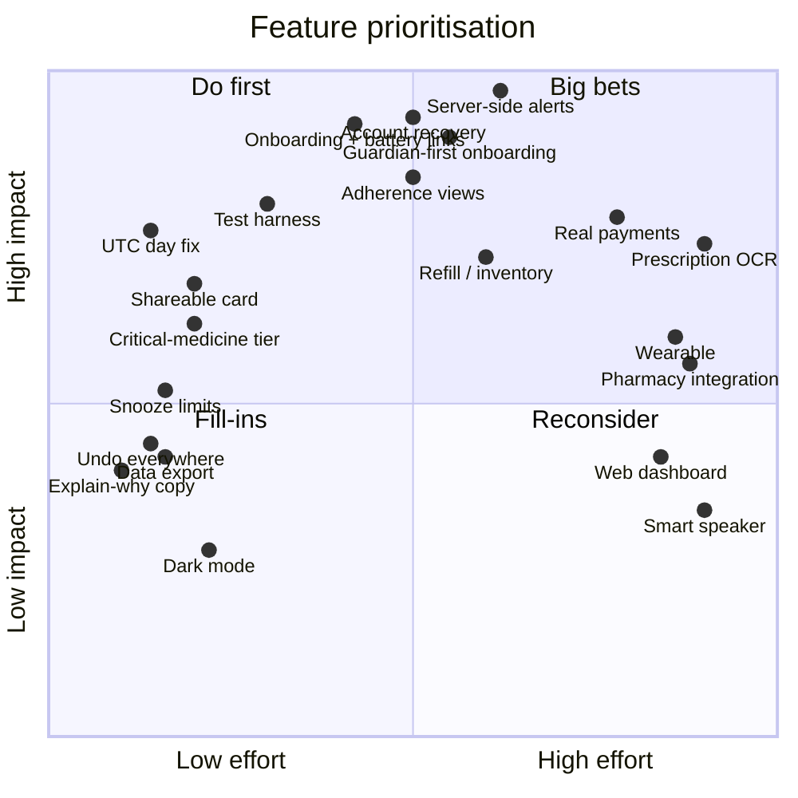

# PillReminder — Feature Inventory

> **Purpose.** Three lists: what is **built**, what is **missing**, and what we could
> **add** to grow the audience and make the app genuinely better. Every "built" claim was
> verified against the code on branch `feat/guardian-alarm-actions`.
>
> Legend — **✅ Done** · **🟡 Partial** (works but incomplete or inconsistent) ·
> **🔴 Stub** (scaffolding only) · **❌ Missing**

---

## Contents

- [Part A — Features covered](#part-a--features-covered)
- [Part B — Gaps in what exists](#part-b--gaps-in-what-exists)
- [Part C — Features yet to cover](#part-c--features-yet-to-cover-planned-scope)
- [Part D — Growth features](#part-d--growth-features-audience-pull)
- [Part E — "Better place" features](#part-e--better-place-features-quality-dignity-trust)
- [Prioritisation](#prioritisation-impact-vs-effort)
- [Competitive positioning](#competitive-positioning)
- [Recommended next five](#the-recommended-next-five)

---

# Part A — Features covered

## A1 · Identity & accounts

| Feature | Status | Notes |
|---|---|---|
| Register with username + password | ✅ | 3–30 chars, letters/digits/`_`/`.` |
| Login with username + password | ✅ | generic "Invalid credentials" — no user enumeration |
| Auto-login across restarts | ✅ | session persisted to device; local read, no network |
| Logout | ✅ | from Home and the guardian dashboard |
| Role choice at login | ✅ | patient → Home, guardian → GuardianDashboard |
| Unique usernames | ✅ | enforced via synthetic email uniqueness |
| Auto-created profile | ✅ | database trigger, with safe default settings |
| One-time migration of pre-cloud local medicines | ✅ | only when the cloud account is empty |

## A2 · Medicine management

| Feature | Status | Notes |
|---|---|---|
| Add a medicine | ✅ | |
| **Batch add** — many names, one shared schedule | ✅ | each becomes its own record, keeps its own colour |
| Edit a medicine | ✅ | |
| Delete a medicine | ✅ | long-press on Home, or from the edit screen |
| Medicine type | ✅ | Tablet / Capsule / Syrup / Injection / Drops |
| Colour coding | ✅ | 8 named swatches — visual recognition aid |
| Multiple times per day | ✅ | unlimited, de-duplicated, kept sorted |
| Quick-time chips | ✅ | Morning, Before/After lunch, Evening, Before/After dinner, Night |
| Custom time picker | ✅ | scroll-wheel modal |
| Daily frequency | ✅ | |
| Weekly / specific days | ✅ | any subset of the week |
| Per-medicine snooze duration | ✅ | 5 / 10 / 15 / 30 min |
| Per-medicine alarm tone | ✅ | 5 bundled tones with tap-to-preview |
| Per-medicine guardian opt-out | ✅ | `alertGuardian` toggle |
| Validation | ✅ | name, ≥1 time, ≥1 day when weekly |

## A3 · Alarms & reminders

| Feature | Status | Notes |
|---|---|---|
| Exact-time OS alarms | ✅ | exact-alarm permissions declared |
| Repeating daily alarms | ✅ | |
| Repeating weekly alarms | ✅ | one trigger per time × day |
| Bypasses Do Not Disturb | ✅ | all five tone channels |
| Maximum-importance channels | ✅ | heads-up + full-screen candidacy |
| Full-screen alarm over the lock screen | ✅ | wake lock, gestures disabled |
| Looping audio at full volume | ✅ | "do not mix" mode — won't be ducked |
| Vibration pattern | ✅ | three long pulses |
| Notification action buttons | ✅ | Taken / Reschedule / Skip from the shade |
| Sticky, non-auto-dismissing notification | ✅ | unanswered alarms stay visible |
| Snooze (one-shot reschedule) | ✅ | recurring schedule unaffected |
| Survives app kill and reboot | ✅ | boot permission + resync on launch |
| No phantom or duplicate alarms | ✅ | cancel-all-and-rebuild on every mutation |
| Tone fallback if an asset fails | ✅ | falls back to the default alarm sound |
| Alarms work offline | ✅ | OS-registered in advance; medicine cache resolves name and tone |

## A4 · Adherence tracking

| Feature | Status | Notes |
|---|---|---|
| Append-only dose ledger | ✅ | `taken` / `snoozed` / `skipped` / `missed` with timestamps |
| Mark taken from the alarm screen | ✅ | |
| Mark taken from the notification | ✅ | |
| Mark taken from Home | ✅ | tap to toggle |
| Batch actions per time slot | ✅ | Taken / Reschedule / Skip for a whole slot |
| Today view grouped by time | ✅ | mirrors how people actually take pills |
| Derived per-medicine state | ✅ | taken › skipped › snoozed › pending › upcoming |
| Slot status | ✅ | done / due / upcoming, colour-coded with badges |
| "Other days" section | ✅ | medicines not scheduled today, dimmed |
| Pull-to-refresh | ✅ | |
| 2-year rolling retention | 🟡 | client prune works; the nightly DB job ships **commented out** |

## A5 · Guardian / caregiver

| Feature | Status | Notes |
|---|---|---|
| Guardian accounts | ✅ | same account model, different landing screen |
| 6-digit one-time pairing code | ✅ | SHA-256 at rest, shown once, 30-day expiry, single-use |
| Pair by username + code | ✅ | two facts required |
| Share invite via the system share sheet | ✅ | pre-written instructions |
| Revoke a guardian | ✅ | immediate; also kills outstanding codes |
| Change guardian | ✅ | on a 1-guardian plan a new pairing replaces the old |
| Multi-guardian by plan | ✅ | enforced server-side inside the pairing function |
| Guardian dashboard of linked people | ✅ | |
| Guardian reads the medicine list | ✅ | name, form, colour, times, snooze, tone |
| Guardian reads the health report | ✅ | |
| Guardian proposes a medicine | ✅ | full medicine form in request mode |
| Patient approves or rejects | ✅ | dedicated screen + Home badge |
| Optional auto-approval | ✅ | patient-controlled setting |
| Configurable grace period | ✅ | 5 / 15 / 30 / 60 min |
| Notify guardian on missed dose | ✅ | *but see B1 — client-side send* |
| Notify guardian on explicit skip | ✅ | distinct wording |
| Optional notify on dose taken | ✅ | off by default |
| Alert de-duplication | ✅ | once per medicine per day |
| Separate, softer guardian channel | ✅ | doesn't shriek like a patient's own alarm |
| Snooze-aware missed detection | ✅ | snooze extends the deadline, doesn't cancel it |
| Background sweep | ✅ | ~15 min, survives termination and reboot |
| Redundant sweep triggers | ✅ | background + foreground + Home focus + on skip |

## A6 · Health trackers

| Feature | Status | Notes |
|---|---|---|
| Blood pressure (systolic/diastolic) | ✅ | |
| Blood sugar | ✅ | |
| Cholesterol (total/HDL/LDL) | ✅ | |
| Weight | ✅ | |
| Notes per reading | ✅ | e.g. "fasting", "after food" |
| Numeric validation | ✅ | |
| Recent-readings list | ✅ | |
| Delete a reading | ✅ | long-press |
| Report: latest / avg / min / max / count | ✅ | per field |
| Share the report as text | ✅ | any messaging app |
| Guardian views the report | ✅ | same screen, patient's id |
| Extensible reading types | ✅ | jsonb values — new types need no migration |

## A7 · Plans & payments

| Feature | Status | Notes |
|---|---|---|
| Plan catalogue in the database | ✅ | Free / Plus ₹99 / Family ₹199 |
| Plans screen with current plan | ✅ | |
| Guardian-limit entitlement | ✅ | the one entitlement actually enforced, server-side |
| Mock activation | ✅ | honest "test mode, no charge" messaging |
| Subscription + payment-method tables | ✅ | token-only by design; no raw card data |
| Provider routing by country | 🔴 | Razorpay(IN) / Stripe(US,CA) mapping exists; country hard-coded `'IN'` |
| Real checkout | 🔴 | stub returns "not enabled" |
| Auto-renew | 🔴 | a boolean column; no mandate, no renewal job |
| Webhooks | ❌ | |

## A8 · Platform & infrastructure

| Feature | Status | Notes |
|---|---|---|
| Cloud data with row-level security | ✅ | every table denies by default |
| Privileged functions for trusted rules | ✅ | pairing, guardian limits |
| Offline read fallback | ✅ | medicine cache |
| Cross-device sync | ✅ | same account, any phone |
| Alarm re-arm on a new device | ✅ | |
| OTA JavaScript updates | ✅ | EAS Updates on a channel |
| Cloud APK builds | ✅ | preview + production profiles |
| Android permissions declared | ✅ | exact alarm, full-screen intent, wake lock, boot, notifications, vibrate |
| Notification channels pre-created at startup | ✅ | never discovered missing at alarm time |
| Battery/permission troubleshooting guide | 🟡 | in the README, not in the app |

---

# Part B — Gaps in what exists

Not new features — places where a shipped feature is incomplete or wrong. These are the
highest-value fixes because the surrounding work is already done.

## B1 · 🔴 Missed-dose alerts depend on the patient's phone being awake

The sweep runs **on the patient's device** and pushes directly to Expo. If that phone is
off, offline, or killed by an OEM battery manager, **no alert is ever sent** — precisely
the situation a guardian is paying attention for. It also means a patient's client
handles the guardian's push token.

*Fix:* server-side scheduled sweep holding the push credential, with a shared
`alert_log` for idempotency. → **Sprint 6**

## B2 · 🔴 No account recovery

Synthetic emails (`username@pillreminder.app`) point at no real mailbox, so password
reset and verification cannot work. A forgotten password is a lost account, and the
target demographic forgets passwords.

*Fix:* optional verified email or phone as a recovery factor. → **Sprint 7**

## B3 · 🟡 Day boundaries computed in UTC

Ledger `day` keys use the UTC date while dose times are local, so in IST any dose logged
before 05:30 files under the previous day — shifting the Today view, adherence and
reports for every non-UTC user.

*Fix:* local date, or store a timezone and derive `day` server-side. → **Sprint 5**

## B4 · 🟡 Subscriptions are client-writable

A user can insert their own active subscription row and raise their guardian limit.
Harmless while everything is free; unacceptable once money is involved.

*Fix:* revoke the client write policy; only a verified webhook may grant entitlement.
→ **Sprint 7 / 11**

## B5 · 🟡 Guardians cannot see adherence history

The data exists, the permission exists, the UI does not. A guardian sees the medicine
list and vitals but not whether doses are actually being taken — arguably the thing they
most want.

*Fix:* adherence history screen, reused for the guardian view. → **Sprint 9**

## B6 · 🟡 No notification when a guardian request arrives

The patient discovers a pending request only by opening the app; the guardian is never
told whether it was approved or rejected.

*Fix:* push both directions. → **Sprint 9**

## B7 · 🟡 Plan tiers aren't differentiated

The plans screen shows identical bullets for Free, Plus and Family. Only the guardian
limit differs. There is no reason to pay.

*Fix:* decide the paywall, then enforce it server-side. → **Sprint 11**

## B8 · 🟡 Reschedule durations differ by entry point

The notification button honours the medicine's snooze setting; the alarm screen offers
hard-coded 5 and 10 minutes.

*Fix:* one rule. → **Sprint 5**

## B9 · 🟡 Health report window is shared across types

The report pulls the most recent readings across *all* types together, so a frequent
blood-pressure logger can push their weight history out of their own report.

*Fix:* per-type queries or a date range. → **Sprint 9**

## B10 · 🟡 No offline write queue

Reads degrade gracefully; writes do not. A dose marked with no connection is lost.

*Fix:* outbox with replay on reconnect. → backlog

## B11 · 🔴 No automated tests

Zero test files. The deadline and state-derivation rules are pure functions — the easiest
possible things to test, and the most costly to get wrong.

*Fix:* extract to `src/domain/`, table-driven tests. → **Sprint 5**

## B12 · 🟡 Battery-optimisation guidance lives in the README

The single most common cause of "my alarm didn't ring" is documented where users will
never look.

*Fix:* in-app onboarding with per-OEM deep links, plus a health-check card. → **Sprint 8**

## B13 · Smaller items

| Item | Note |
|---|---|
| `ringtone.js` is unwired | a system-ringtone picker exists but no screen uses it (superseded by bundled tones) |
| `CHANNEL_ID` constant unused | dead code in `notifications.js` |
| Client-generated medicine id always discarded | the row mapper drops non-UUID ids; the DB generates them |
| `is_guardian` flag never read | recorded at sign-up, gates nothing |
| `kind: 'edit_medicine'` has no producer | schema anticipates guardian edit requests; not built |
| Vestigial `user` parameters | left over from the local→cloud migration |
| `@pr_guardian_*` legacy keys | superseded by `guardian_links` |
| Guardian limit rests on a missing write policy | the enforcing DB index was dropped in the multi-guardian migration |
| Per-device alert dedup | reinstall or a second device can cause a duplicate alert |
| No account deletion | required by Play Store policy |
| iOS unconfigured | no bundle identifier; the full-screen alarm model doesn't exist on iOS |

---

# Part C — Features yet to cover (planned scope)

Committed direction, sequenced in [`03-sprint-plan.md`](./03-sprint-plan.md).

## C1 · Reliability and trust

| Feature | Value | Sprint |
|---|---|---|
| Server-side missed-dose detection | the core promise actually holds | 6 |
| Delivery receipts and retry for alerts | know an alert landed | 6 |
| Account recovery (email/phone OTP) | nobody loses their account | 7 |
| Pairing-attempt rate limiting | 6 digits are brute-forceable | 7 |
| Crash and error reporting | know what's broken in the field | 10 |
| Product analytics | know what's used | 10 |
| Account deletion with cascade | policy + ethics | 10 |

## C2 · Onboarding and comprehension

| Feature | Value | Sprint |
|---|---|---|
| Guided first run with permission steps | most users never reach a working alarm unaided | 8 |
| Per-OEM battery-settings deep links | eliminates the top failure cause | 8 |
| Permission health-check card | self-diagnosis before a dose is missed | 8 |
| "Test my alarm" button | instant confidence on the user's own device | 8 |
| Real empty and error states | no silent blank screens | 8 |
| QR pairing option | no reading digits over a phone call | 8 |

## C3 · Insight

| Feature | Value | Sprint |
|---|---|---|
| Adherence calendar heat map | see the pattern, not just today | 9 |
| Adherence % over 7/30/90 days | the number a doctor asks for | 9 |
| Guardian adherence view | closes the guardian's biggest blind spot | 9 |
| Weekly digest push | passive re-engagement without nagging | 9 |
| Streaks | habit reinforcement | 9 |
| Vitals trend charts | a trend beats a number | 9 |

## C4 · Monetisation

| Feature | Value | Sprint |
|---|---|---|
| Real Razorpay checkout (UPI + cards) | revenue | 11 |
| Signed webhooks as the only entitlement source | correctness and security | 11 |
| Auto-renew (UPI AutoPay / e-NACH) | predictable revenue | 11 |
| Server-side entitlement function | one place to trust | 11 |
| Stripe for US/CA | second market | 11 |
| Billing UX: receipts, cancel, restore | table stakes | 11 |
| Play Billing policy resolution | may reshape all of the above | 11 (refine first) |

## C5 · Inclusion

| Feature | Value | Sprint |
|---|---|---|
| Accessibility audit and fixes | the audience skews elderly and low-vision | 12 |
| Large-text mode | usable at 200% font scale | 12 |
| Hindi and Telugu | the actual first market | 12 |
| Voice announcement of the medicine | usable without reading | 12 |
| Dark mode | night comfort | 12 |
| iOS go/no-go | platform reach decision | 12 |

## C6 · Medication depth

| Feature | Value | Sprint |
|---|---|---|
| Stock / inventory tracking | never run out | 13 |
| Low-stock and refill reminders | the top request in this category | 13 |
| Prescription photo attachment | the source of truth in one place | 13 |
| Doctor and pharmacy contacts | one-tap call | 13 |

---

# Part D — Growth features (audience pull)

Ranked by expected pull per unit of effort. These are proposals, not commitments.

## D1 · 🥇 Guardian-first onboarding — *reverse the funnel*

**The insight.** Today the patient must install, register, generate a code and read it
out. But the person with the motivation and the phone skills is usually the **adult
child**, not the parent. The current flow asks the least capable person to do the most
work.

**The feature.** A guardian creates the account *for* their parent, enters the medicines,
and sends a single invite link. The parent installs, taps once, and their alarms are
already configured.

**Why it pulls.** One motivated caregiver can onboard several relatives. It converts the
hardest segment (low tech confidence) into the easiest.

*Effort: M · Impact: Very High* → Sprint 14

## D2 · 🥇 Shareable adherence card

A single image — "Amma took 28 of 28 doses this month 💚" — sized for WhatsApp. Family
groups are the distribution channel in this category, and a positive, shareable artefact
travels much further than a referral banner.

*Effort: S · Impact: High* → Sprint 14

## D3 · 🥇 Multi-patient guardian dashboard

One guardian, several patients, one screen sorted by urgency (red first). This is what a
person caring for two parents plus an aunt actually needs, and it is the natural anchor
for the Family tier.

*Effort: M · Impact: High* → Sprint 14

## D4 · Family / care-circle roles

`guardian_links.permissions` already exists. Viewer (sees status), Helper (proposes
changes), Manager (edits directly with standing consent). Lets a family divide
responsibility instead of funnelling everything through one person.

*Effort: M · Impact: Medium-High* → Sprint 14

## D5 · Doctor-visit PDF export

A one-page adherence + vitals summary for an appointment. Doctors asking "have you been
taking it regularly?" get a real answer. If clinicians start asking patients to bring
one, that is word-of-mouth from the highest-authority source available.

*Effort: M · Impact: High*

## D6 · Wearable companion (Wear OS)

Vibration on the wrist plus tap-to-confirm. For someone who cannot always hear a phone,
this is the difference between a reminder and a reminder that works. Also a clear,
demonstrable differentiator.

*Effort: L · Impact: Medium-High*

## D7 · Prescription OCR

Photograph a prescription; the app proposes medicine names, doses and schedules for
confirmation. Manual entry is the biggest drop-off point in every medication app;
removing it converts far more installs into active users.

*Effort: L · Impact: High* (accuracy and safety review essential — never auto-commit)

## D8 · Appointment reminders and visit prep

Doctor appointments in the same app, with a pre-visit checklist ("bring your BP log,
ask about the new tablet"). Broadens from daily adherence to whole care management and
gives a reason to open the app between doses.

*Effort: M · Impact: Medium-High*

## D9 · Symptom and side-effect diary

Log how you feel alongside what you took. Correlating a new tablet with new dizziness is
genuinely clinically useful, and it is the kind of data a doctor changes a prescription
over.

*Effort: M · Impact: Medium*

## D10 · Caregiver web dashboard

A browser view of the same data. Adult children work at desks; a phone-only product
loses their daytime attention.

*Effort: L · Impact: Medium*

## D11 · Pharmacy integration

Low stock → one-tap reorder from a partner pharmacy. Strong utility, and the clearest
revenue path that isn't a consumer subscription — Indian e-pharmacies have affiliate
programmes.

*Effort: L · Impact: Medium-High* (partnership-dependent)

## D12 · Smart-speaker / voice assistant

"Alexa, did Amma take her tablets?" Voice suits the demographic better than any UI.

*Effort: L · Impact: Medium*

---

# Part E — "Better place" features (quality, dignity, trust)

Features that make the app *better*, not just bigger. Several are cheap and
disproportionately improve how the product feels.

## E1 · Positive-only framing

The app currently records `missed` and alerts a guardian. That is necessary but
one-sided. Add streaks, "best month yet", and gentle re-entry after a lapse — never
"you failed 4 doses". Adherence apps that shame get uninstalled; the emotional register
is a product feature. **Effort: S**

## E2 · Patient dignity controls

An adult being monitored by their child needs agency. Give the patient: a visible log of
exactly what their guardian can see, a pause-sharing switch (with the guardian informed
that sharing is paused, not silently blinded), and per-medicine privacy so a sensitive
prescription can be excluded. Trust is what makes people keep sharing. **Effort: M**

## E3 · Snooze limits and escalation

Unlimited snoozing lets a dose be deferred all day. Offer a per-medicine maximum ("after
3 snoozes, alert my guardian"). Gives the patient control while keeping the safety net.
**Effort: S**

## E4 · Critical-medicine tier

Not all medicines are equal — insulin is not a vitamin. Mark a medicine critical: shorter
grace, escalate faster, alert every guardian, louder tone. Focuses urgency where it
belongs and reduces alert fatigue elsewhere. **Effort: S**

## E5 · "I'm away" / travel mode

Timezone changes currently break the mental model entirely. Detect a timezone change and
ask: shift the schedule or keep home times? A specific, common, badly-handled case.
**Effort: M**

## E6 · Do-not-disturb windows

An alarm at 22:00 when someone sleeps at 21:00 gets muted — and then all alarms get
muted. Let the user declare sleep hours and warn when a schedule collides with them.
**Effort: S**

## E7 · Explain-why copy

Every permission request and every alert should say why in one plain sentence. "We need
exact alarms so your 8 AM tablet rings at 8 AM, not 8:20." Comprehension is an
accessibility feature. **Effort: S**

## E8 · Undo everywhere

Deleting a medicine deletes its schedule. Add a 5-second undo on every destructive
action. Cheap, and it removes a whole class of user distress. **Effort: S**

## E9 · Data export and portability

One tap to export everything as CSV/JSON. It is a trust signal ("your data isn't hostage"),
it satisfies data-protection expectations, and it costs almost nothing. **Effort: S**

## E10 · Offline-first writes

Complete the offline story so a dose recorded on a train is not lost. **Effort: M**

## E11 · Accessibility as a first-class constraint

Not a sprint item but a standing rule: minimum 48dp targets, 4.5:1 contrast, screen-reader
labels on every control, never colour alone. This audience needs it more than most.
**Effort: M once, then ongoing**

## E12 · Honest, humane error messages

Replace every silent failure with a plain-language explanation and a retry. "Couldn't save
— you're offline. We'll try again." **Effort: S**

---

## Prioritisation: impact vs effort

---

## Competitive positioning

| Capability | PillReminder today | Typical pill reminders | Caregiver apps |
|---|---|---|---|
| Full-screen DND-bypassing alarm | ✅ strong | often a plain notification | rare |
| Per-medicine tone + colour + form | ✅ | rare | rare |
| Guardian alerted on a missed dose | ✅ *(client-side — B1)* | rare | ✅ |
| Consent-based pairing with patient approval | ✅ **differentiator** | — | usually guardian-controlled |
| Vitals tracking + shareable report | ✅ | sometimes | ✅ |
| Adherence history / analytics | ❌ | ✅ common | ✅ |
| Refill / inventory | ❌ | ✅ common | ✅ |
| Prescription OCR | ❌ | some | some |
| Offline-first alarms | ✅ | varies | varies |
| Local-language support | ❌ | rare | rare |

**Where PillReminder is genuinely differentiated:** alarm quality and the *consent
architecture* — the guardian proposes, the patient approves, and the patient can revoke
unilaterally. Most caregiver apps treat the patient as the object of monitoring rather
than its owner. That is a real, defensible position, and Hindi/Telugu support plus
guardian-first onboarding would compound it in the Indian market specifically.

**Where it is behind:** adherence analytics and refill tracking are table stakes that
competitors ship and this app does not — which is exactly why they sit in Sprints 9 and
13.

---

## The recommended next five

If only five things get built, build these — in this order.

| # | What | Why |
|---|---|---|
| 1 | **Server-side missed-dose alerting** (B1) | the core promise currently fails in the exact scenario that matters most |
| 2 | **Account recovery** (B2) | a forgotten password is a lost user, and this audience forgets passwords |
| 3 | **Onboarding with per-OEM battery deep links + health check + test alarm** (B12) | fixes the #1 real-world failure, which is a settings problem the app never mentions |
| 4 | **Adherence history for patient and guardian** (B5) | the data and permissions already exist; only the view is missing — highest value per point in the backlog |
| 5 | **Guardian-first onboarding** (D1) | reverses the funnel so the capable person does the setup; the single biggest growth unlock |

Everything in Part B before anything in Part D. A product whose central safety feature
silently fails does not benefit from more features — it benefits from that feature
working.
